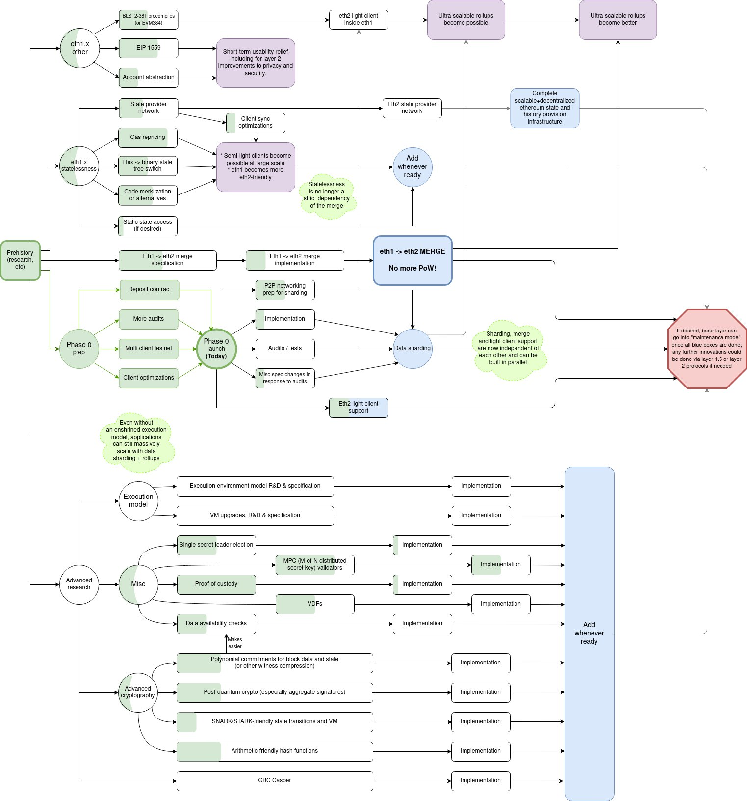
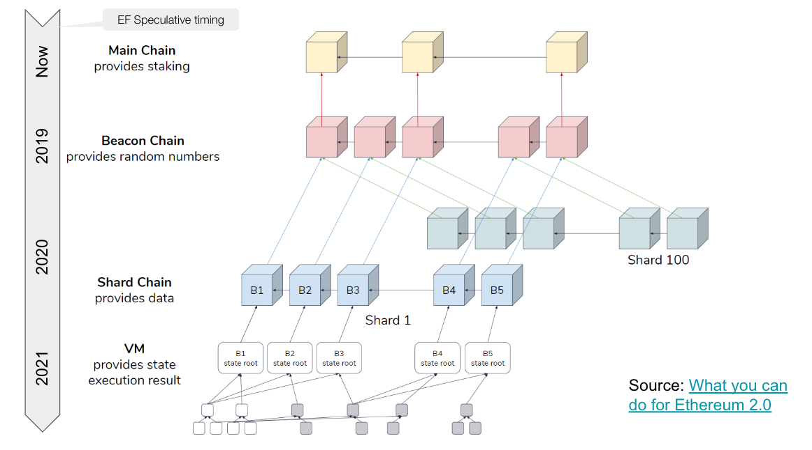
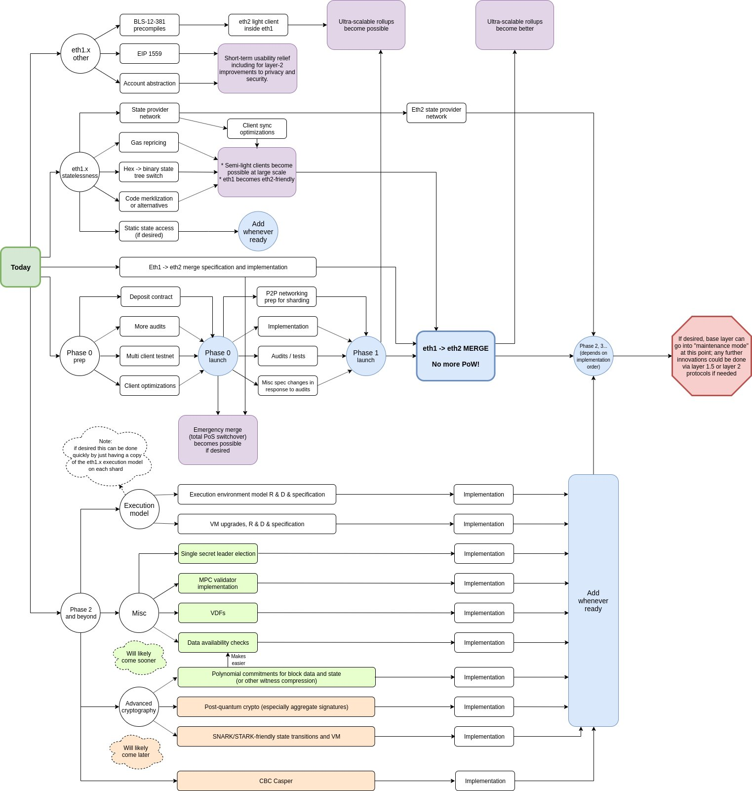

# Eth2 概览

## 以太坊2.0路线图（新）

2020年10月，Vitalik Buterin 在 ethereum magicians 论坛发文阐释了“[以rollup为中心的以太坊路线图](https://news.ethereum.cn/a-rollup-centric-ethereum-roadmap/)”，提出了“少数执行分片+layer2”的发展路线。

2020年11月，以太坊基金会研究团队在
 Reddit 论坛进行的[第五次AMA](https://www.reddit.com/r/ethereum/comments/jvkoat/ama_we_are_the_efs_eth_20_research_team_pt_5_18/?utm_source=share&utm_medium=web2x&context=3)（[中文编译版](https://news.ethereum.cn/ama-we-are-the-efs-eth-20-research-team-pt-5-18/)）中给出了以太坊2.0的新路线图，总的来说可以看作是**“可执行PoS信标链+数据分片+layer2”**的架构，以下信息摘自该次AMA：

[Vitalik 关于路线图的阐释：](https://www.reddit.com/r/ethereum/comments/jvkoat/ama_we_are_the_efs_eth_20_research_team_pt_5_18/gcpqmp1?utm_source=share&utm_medium=web2x&context=3)

1. **以Rollup为中心的路线图。**将“阶段1”\(Phase 1\) 简化为数据分片 \(供rollups使用\)，使其更易于实现。
2. **简化eth1和eth2的合并。**大致是根据这份路线图而来，但是现在 1\) eth1交易能够直接在信标链上进行，而不是分片; 2\) 得亏optimistic执行，合并期间的执行中断时间可能会被大大缩短。这使得合并过程被简化，目前已经开始PoC阶段。
3. **各阶段并行进行。**这是最新的计划，也许 \(其重要性\) 也是最被低估的。可以分成 1\) 轻客户端支持; 2\) 数据分片 \(也即“阶段1”\); 3\) eth1和eth2的合并，这三个过程将独立推进，从而使得每个部分能够被独立实现，而不需要考虑其他部分的研发进度。

这些所有改变的初衷都是为了加快eth2真正可用的进程。轻客户端的支持可能会在分片之前实现，使得信标链能快速可用 \(为eth1提供共识\)。经过简化的合并过程意味着eth1和eth2的合并会比之前预设的要快。各阶段并行进行，可以进一步加速合并，甚至有可能在分片实现之前就能进行合并。

作为rollup中心策略的一部分，“阶段2” \(phase 2, 也即分片执行\) 目前来看没有那么重要。主要是因为阶段2的终极目标 \(即实现高TPS\) 能够在数据分片 \(阶段1\) + rollups的基础上实现，甚至效果更好。而分片+rollups会在阶段2之前实现，因此目前在这个部分集中精力是更好的选择。也就是说，我们不会采取任何不可逆的举动，使得在将来无法添加本地分片执行功能。如果将来有需要的话，这个路线图能够随时兼容分片执行功能。

[Justin Drake 对交付顺序的评论：](https://www.reddit.com/r/ethereum/comments/jvkoat/ama_we_are_the_efs_eth_20_research_team_pt_5_18/gcps4a9/?utm_source=share&utm_medium=web2x&context=3)

Phase 0（PoS）→Phase 0.5（轻客户端）→Phase 1（数据分片）→Phase 1.5（eth1和eth2合并） →Phase 2（内置VM）

----------------------------------------------------------------------------------------------------------------------------------------------------------------------

#### **新路线图的变化**

1. 阶段1简化为数据分片，将其作为rollup或是其他layer2方案的数据可用性层
2. 信标链将具备执行功能，当前以太坊主链能够直接合并到以太坊2.0链中，不再以分片形式并入
3. 轻客户端、分片以及eth1和eth2的合并工作将并行推进，不再顺次实现
4. 暂时搁置阶段2，但是保留分片执行的可能性。

----------------------------------------------------------------------------------------------------------------------------------------------------------------------

#### **Vitalik在推特更新了以太坊2.0的研发路线和进展**

## 以太坊2.0路线图（旧）

以太坊下一步的重要网络升级称为 Ethereum 2.0，eth2 或 Serenity，将带来分片 \(Sahrding\)、权益证明共识机制 \(Proof of Stake\)、新虚拟机 \(eWASM\)等重大改变。

首先我们需要明确的是，**eth2升级并非一蹴而就，而是划分成多个阶段逐步进行。**以下内容旨在提供eth2的阶段概况参考，让关注以太坊的爱好者们对升级路线心中有数。

## Eth2的设计原则及目标

#### ⚖ 设计原则

Vitalik Buterin给出的[Ethereum 2.0设计原则](https://notes.ethereum.org/9l707paQQEeI-GPzVK02lA?view#Principles)：

\*\*\*\*◽ **Simplicity 简洁性**

特别是由于加密经济 PoS 和二次分片 \(quadratic sharding\) 在本质上很复杂，因此协议应该在其决策中尽可能地追求最大的简洁性。这是非常重要的，因为这将能够：

* \(i\) 最大限度地减少开发成本，
* \(ii\) 减少发生意外安全问题的风险，
* \(iii\) 使得协议设计人员更容易让用户确信参数选择的合法性。

通过[此链接](https://radicalxchange.org/blog/posts/2018-11-26-4m9b8b/)可以了解相关背景信息。当实现特定级别的功能时，我们无法避免一定的复杂性。复杂性的优先级别是：Layer2 协议的复杂性 &gt; 客户端实现的复杂性 &gt; 协议规范的复杂性。

◽**Long-term stability 长期稳定性**

理想情况下，应该构建较低级别的协议，这样就不需要在 10 年或更长时间内更改协议，并且任何需要的创新都可以在更高的级别 \(客户端实现或 Layer2 协议\) 上进行。

◽**Sufficiency 丰富性**

在协议之上应能够构建尽可能多的应用程序类别。

◽**Defense in depth 深度防御性**

协议应能够在各种可能的安全性假设 \(例如网络延迟、故障数量、用户动机等\) 情况下持续运行。

◽**Full light-client verifiability 轻客户端可验证性**

鉴于一些安全性假设 \(例如网络延迟、攻击者预算界限、诚实验证者占少数等\)，验证 O© 数据 \(理想情况是只验证信标链\) 的客户端应该能够获得间接的保障：即使是在受到 51% 攻击的情况下，整个系统的所有数据可用且有效 \(注：这是达到“深度防御性”的其中一个目标\)。

#### 🎯 设计目标

以太坊研者Danny Ryan就Ethereum 2.0给出了五个不同的[设计目标](https://github.com/ethereum/eth2.0-specs#design-goals)：

◽**Decentralization 去中心化**允许处理能力达 _O\(C\)_ 的消费级笔记本电脑处理/验证 _O\(1\)_ 个分片（可能是系统上任何一层的验证，如信标链）；

◽**Resilience 强韧性：**在主网分区之后，即使大部分节点离线，整个系统依旧能够运行；

◽**Security** **安全性：**通过密码学技术和设计技术提高验证者的总人数和单位时间内的参与者数量；

◽**Simplicity** **简洁性：**最大程度地降低复杂性，哪怕会导致效率有所下降；

◽**Longevity** **持久性：**选用的组件要能够抵抗量子计算，或是选用可替换型组件直到可用的抗量子计算组件出现。

## Phase 0 

#### 📌 关键词：PoS，信标链

[阶段0](https://github.com/ethereum/eth2.0-specs#phase-0)的主要任务是启动信标链 \(Beacon Chain\)。作为eth2的核心，信标链将为其自身和将来所有的分片链管理Casper权益证明协议，引导着eth2其他所有方面的发展。

正如[Ben Edgington](https://media.consensys.net/state-of-ethereum-protocol-2-the-beacon-chain-c6b6a9a69129)所提到的，该阶段的工作涉及许多方面，包括管理验证者及其押金、选择区块提议者、组织验证者进入委员会、对提议区块进行投票、应用共识规则、验证者的奖惩机制、促进跨分片交易等。

信标链上的主要负载来源将是“证明” \(attestations\)。证明是针对分片区块可用性的见证信息，同时也是信标区块的PoS见证信息。当一个分片区块取得了足够数量的证明，将创建一个“交联” \(crosslink\)，该“交联”可以确认将信标片段（到该分片区块为止）整合到信标链中。

阶段0将使用 Caspe FFG \(the Friendly Finality Gadget/友好的最终确定性小工具\) 来保障最终确定性 \(finality\)。简单来说，最终确定性意味着某项特定操作一旦完成，就将永远铭刻在历史中，并且无法还原。

#### 🔸 ETH2/BETH：信标链新ETH代币

阶段0将引入ETH2/BETH，成为供信标链验证者使用的新资产，主要有两种产生方式：

* 作为信标链的验证奖励分发（阶段1后还包括分片中的验证奖励）；
* 所有ETH1.x用户都通过[注册合约](https://github.com/ethereum/beacon_chain/blob/master/contracts/validator_registration.v.py)（registration contract）以1 ETH的价格购买，合约将其称作deposit。

需要清楚的是，阶段0不支持从信标链中撤回或转移ETH2，ETH1一经存入验证者注册合约后，将在以太坊1.0链中被销毁。信标链验证者会跟踪该合约，并向信标链提交存款信息，然后再由信标链将ETH2发放给存款人。

一旦阶段0激活，将存在两条以太坊区块链：Eth1链（PoW主链）和Eth2链（信标链/PoS链）。 信标链是eth2的基础，也是核心组件，能够起到管理验证者并且协调分片链的作用。

## Phase 1

#### 📌 关键词：分片，数据可用性，交联

 阶段1的实现以阶段0为基础，主要内容是将数据写入分片链。由于阶段0为分片链奠定了大部分基础工作，阶段1实现的复杂程度比其他组件要低得多。

分片链是将来可扩展性的关键，因为其允许并行处理交易而大大提升了吞吐量，目前最新方案是在阶段1中部署64个分片（将来或许会更多）。

阶段1主要涉及在分片链写入数据，并实现其有效性和共识性。分片链尚未拥有账户、资产或智能合约。由于缺乏支持并行处理交易的执行环境，阶段1更像是试运行分片结构，而不是直接借助分片进行扩展的尝试。

\*\*\*\*🔗 **交联 Crosslink**

每个分片的当前状态（“组合数据根”）会周期性地记录在信标链区块中，作为交联，其中包含自上一个交联以来给定分片中的所有区块。当信标链区块最终确定后，相应的分片区块也将被视为最终确定，如此其他分片可以信任该分片并进行跨分片交易。

交联是：

* 委员会的一个签名集合，作为分片链中某个区块的证明（attestation），证明其可以被添加进信标链中；
* 信标链获取分片链状态更新的主要方式；
* 异步跨分片通信的基础设施。

信标链在各个slot中为每个分片随机分配的验证者，只是就分片区块的内容达成共识，而要证明分片的内容和状态，则需要通过交联。在阶段 2 甚至更高阶段，交联将支持跨分片通信（Cross-Shard Communication）。

## Phase 2

#### 📌 关键词：状态执行，执行环境，eWASM，跨分片通信

阶段2的许多功能目前还处于积极研发阶段。

可以明确的是，阶段2将能够整合系统各部分的功能性。分片链将从简单的数据容器过渡到结构化的链状态，并重新引入智能合约。每个分片将管理基于[eWASM](https://github.com/ewasm/design)的虚拟机，支持帐户、合约、状态以及solidity中为人所熟知的其他抽象。在阶段2之前或阶段2内或有希望使得常见的开发者工具支持eWASM，如truffle、solc、ganache。

阶段2还会引入“执行环境”（EEs）的概念。开发者可以根据意愿来构建分片中的EE，例如支持UTXO-style链、Libra-style系统或是中继费用市场等。每个分片都可以访问所有EEs，并且能够在其中执行事务，运行智能合约并与之交互。执行环境仍处于集中研发阶段。

## 其他阶段

根据github的[分片路线图](https://github.com/ethereum/wiki/wiki/Sharding-roadmap#roadmap)，eth2将划分为六个阶段，但鉴于后续研发的工作量较大且时隔较长，具体计划还需要依托前面几个阶段的具体实现情况，所以仍然具有完善和改动空间。

## 参考来源

* [Ethereum 2.0 Info](https://hackmd.io/@benjaminion/By6gV_dXS)
* [Ethereum 2.0 Specifications](https://github.com/ethereum/eth2.0-specs)
* [Serenity Design Rationale](https://notes.ethereum.org/@vbuterin/rkhCgQteN?type=view#Serenity-Design-Rationale)
* [Ethhub](https://docs.ethhub.io/ethereum-roadmap/ethereum-2.0/eth-2.0-phases/)
* [Sharding Roadmap](https://github.com/ethereum/wiki/wiki/Sharding-roadmap#roadmap)
* [Ethereum 2.0 Devs Handbook](https://notes.ethereum.org/@serenity/handbook#-Ethereum-20-Devs-Handbook-and-FAQs)

#### 提示

由于以太坊基金会团队和第三方团队的相关信息更新频繁，因此许多文档都将不定时更新。

