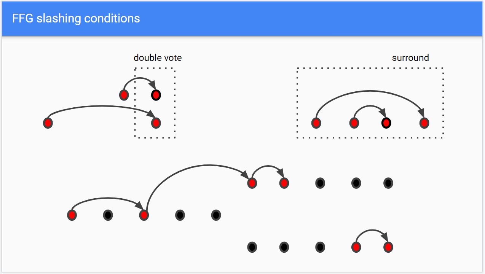

# Eth2 术语库

## A

#### **Attestation 证明**

证明是指验证者所发起的投票，由验证者的签名聚合而成，用以证明区块的有效性，投票通过验证者的余额进行加权。

 

#### **Attester 证明者**

信标链上的验证者可以充当区块提议者和证明者，证明者对区块发起投票。

## B

#### **Beacon Chain 信标链**

以太坊2.0阶段0中实现，将引进权益证明 \(PoS\) 共识机制。也被认为是Eth2的“协调层”。

职能：

* 为验证者分配职责
* 对检查点进行最终确定
* 在协议层上执行随机数生成
* 巩固信标链
* 对链头进行投票，作为分叉选择的基础
* 针对分片链的过渡/数据进行连接和投票

#### **Block proposer 区块提议者**

由信标链通过RANDAO机制随机选择出来的验证者，对下一个区块进行提议。每个slot中仅有一个区块提议者。

## C

#### **Casper FFG**

Casper FFG是基于PoS共识机制的区块最终确定系统，其规定了区块最终确定的规则，并对已确定的区块进行检测。Casper FFG融合了PoS算法技术及拜占庭容错共识原理，其与链增长过程脱钩，可以作为一个独立的叠加层，为任何有效区块链协议提供最终确定区块的服务。与PoW共识机制相比，FFG可以为区块链带来更高的安全性，防止区块被篡改。

Casper FFG vote指验证者为最近一个epoch的检查点即 “目标检查点” 和前一个检查点即 “来源检查点” 发起投票，证明投票由验证者广播到p2p网络，最终再由区块生产者打包进区块。

#### **Committees 委员会**

信标链和分片里每个slot中的委员会至少由128位验证者组成，根据伪随机过程RANDAO，验证者们被随机分配到委员会中，对区块发起投票，确定其有效性。

#### **Checkpoint 检查点**

检查点指位于每个epoch第一个slot里的区块，如果该slot内没有产生区块，则最近的前一个区块为检查点。每个epoch都会有一个检查点区块；一个区块可能同时是多个epoch的检查点。

#### **Chain head 链头**

链头是指信标链或分片链末端的一个区块，每个slot中的区块都要发起一次LMD GHOST投票，对信标链头进行验证。

#### **Crosslink 交联**

交联是指将一个信标区块和一个分片区块连接起来，在一个交联中，信标链紧跟分片链头。交联计划于eth2的阶段1实现，为的是将分片扎根在信标链中，为分片分叉选择、分片链最终确定性和跨分片通信打好基础。

\*\*\*\*

#### **Current Balance & Effective Balance 现存余额&有效余额**

现存余额指验证者当前持有的ETH总数，而有效余额指根据现存余额计算出来的ETH数量。有效余额规定了验证者获得的ETH赏金或者罚没数量的范围。**有效余额最多为32个ETH。**

以下举例说明了如何计算有效余额：

* 如果现存余额为32个ETH — 有效余额为32个ETH
* 如果现存余额由22个ETH减少到21.76个ETH — 有效余额将为**22个ETH**
* 如果现存余额由22个ETH减少到21.749个ETH — 有效余额将为**21个ETH**
* 如果现存余额增加到19.25个ETH，且原有有效余额为18个ETH，那么有效余额将增加到19个ETH
* 如果现存余额增加到22.25个ETH，且原有有效余额为21个ETH，那么有效余额将增加到22个ETH

**验证者若想要扩大有效余额数量，需要持有的现存余额为“有效余额+1.25个ETH”。**换句话说，如果验证者原本持有有效余额20个ETH，想要增加到21个ETH，验证者的现存余额必须增加到21.25个ETH。如上述第三个例子所示，倘若现存余额减少了0.25个ETH，低于阈值，**有效余额也会随之调整**。

## D

#### Deposit Contract 存款合约

部署在以太坊PoW链上的智能合约。要成为Eth2的PoS验证者，需要首先向存款合约发送一笔交易，包含一定量的ETH作为质押金。存款合约记录了质押历史纪录，并且将所有质押金锁定在PoW链上，之后可以转移至Eth2信标链上。请注意，在Eth2早期阶段，存款合约只支持单向转移，不能将质押金从Eth2转回PoW链。

#### D**ouble proposal 双重提议**

一名区块提议者在他所分配到的slot里提议一个以上的区块。

#### **Double vote 双重投票**

一名验证者针对同一个目标检查点 \(target\)，不同的源检查点 \(source\) 发起的两次FFG投票。 双重投票可以被看做是PoS版本的双花攻击 \(double-spend attack\)。

## E

#### **Epochs 时段**

每个epoch由32个slots \(时隙\) 组成，每个slot为12秒，一个epoch即6.4分钟。

#### **EBB 时段边界区块**

时段边界区块 \(EBB, epoch boundary block\) 是一些文献中用到的术语，可以理解为“检查点”\(checkpoint\) 的同义词。

#### **Execution Environment 执行环境**

计划在Eth2阶段2引进。每个分片共识层内的执行将在执行环境的准则/框架内进行。本质上，执行环境是规则的框架/规则集，用于确定Ewasm作为虚拟机如何进行状态转换。它限制了状态的存储和更改方式。开发者可以按照意愿来构建分片中的EE，例如支持UTXO-style链、Libra-style系统或是中继费用市场等。每个分片都可以访问所有EEs，并且能够在其中执行事务，运行智能合约并与之交互。

## F

#### **Fork choice rule 分叉选择规则**

Eth2中的分叉选择规则是 LMD GHOST \(Latest Message Driven GHOST, 由最新消息驱动的GHOST\)。在该协议中，获得投票数最高的分叉将被选为链头。与最长链规则相比， GHOST的优点在于能够在网络延迟较高时降低攻击效率，同时最小化链重组的深度。即使攻击者能够高效地在其分叉链上继续产生区块，尝试使该链成为最长链，协议也会选择另一条票数更高的分叉链。

#### **Finalization 最终确定**

最终确定性指两个相冲突的区块 \(检查点\) 无法同时被最终确定，也可以称之为经济确定性 \(economic finality\)。在Eth2中，一旦两个相冲突的检查点被最终确定，那么系统中至少三分之一的活跃验证者将受到罚没。如果连续两个epoch被证明 \(或跳过一个epoch的连续两个epoch\)，则第一个epoch被认为获得最终确定。

## **J**

#### **Justification 证明**

证明指验证者对检查点进行投票并确定信标链头的行为。如果2/3的验证者 \(即绝对多数\) 对两个epoches达成共识，例如源检查点 \(source\) 和目标检查点 \(target\)，那么这两个检查点都被证明了。如果连续两个epoch被证明 \(或跳过一个epoch的连续两个epoch\)，则第一个epoch被认为获得最终确定。

## L

#### **LMD GHOST**

LMD GHOST是Eth2中的分叉选择规则。GHOST \(Greediest Heaviest Observed SubTree\) 实际上是一种较早的协议，在PoW和其他区块链中应用颇广。协议仅遵循“最重”子树，即最长链。在比特币语境中，最重分支是哈希算力最高的链，并且被视作是最长链 \(规范链\)。LMD \(Last Message Driven\) 通过“最新消息驱动”来发挥“消息” \(message\) 的作用。消息是一则证明 \(attestation\)，其不同之处在于获得最多票数的分叉将被视为规范链。

## P

#### **Proof of Stake \(PoS\) 权益证明**

权益证明 \(PoS\) 是一种用于公共区块链的共识算法，该算法取决于验证者在网络中的经济权益。在基于工作量证明 \(PoW**\)** 的公共区块链中，通过奖励解决密码难题的参与者，以验证交易并创建新区块 \(即挖矿\)。而在基于 PoS 链中，一组验证者轮流对下一个区块进行提议和投票，每个验证者的投票权重取决于其押金 \(即权益\) 的多少。 PoS 的显着优势包括提高安全性、降低中心化风险和节省能耗。

在以太坊2.0上，激活一名验证者需要在网络中质押32 ETH。

#### **Phase 0 阶段0**

阶段0作为以太坊2.0的首个阶段，目标是启动信标链，预计在2020年实现。阶段0通过管理协调验证者来实现PoW到PoS共识机制的转变。此阶段不会提供分片链或执行等功能，也就是说，参与者在此阶段无法在Eth2网络中进行交易或是调用智能合约。

#### **Phase 1 阶段1**

阶段1是以太坊2.0继阶段0之后的第二次网络升级，主要目标是启动分片链，并将数据写入分片链。分片是提升以太坊可扩展性的关键，因为其允许并行处理交易而大大提升了吞吐量，目前最新方案是在阶段1中部署64个分片（将来或许会更多）。

**Phase 1.5 阶段1.5**

阶段1.5是一个术语，指阶段1升级期间以太坊1.0和2.0区块链的合并时期。在阶段1.5之后，以太坊1.0链将作为2.0链的一个分片运行。彼时，1.0链的全部功能 \(包括ETH的使用\) 将在2.0链上实现，而不会破坏数据一致性。

#### **Phase 2 阶段2**

阶段2是以太坊 2.0的第三个阶段，紧随阶段0和阶段1。阶段2目前的定义不如前两个阶段明确，但预计将包含：添加以太坊账户、支持ETH的跨分片传输和提取、调用合约、构建执行环境，以便基于Eth2构建可扩展的应用，并且将1.0链完全引入2.0，最终弃用工作量证明机制。

## S

#### **Sharding 分片**

分片概念原本指数据库的横向分割，将大型数据库分割为更小、更快、更易于管理的部分。为了保证去中心化，区块链需要采取类似的横向扩容方式。每条分片链都拥有一个节点子集在该链上进行工作。虚拟矿工和验证者被分配到不同的分片中，并且只处理和验证自己所在分片链上的交易。Eth2的短期计划是启用**64个分片，**预计在阶段1实现分片与信标链的交联。

\*\*\*\*

#### **Shuffling “混洗”机制**

验证者“混洗”的主要目的在于确保分片的安全性。由于验证者分散在不同的分片中，有的节点可能会恶意控制某个分片。对验证者进行混洗 \(shuffling\)，使得每个分片区块都有一个委员会，其中的验证者都经由随机挑选。经数学计算，如果攻击者控制的验证者少于总数的三分之一，就难以对某个分片发起攻击。

\*\*\*\*

#### **Slots 时隙**

12秒的时间段，其中随机选择的验证者将提议一个区块。在每个slot中，在信标链和分片中都可能新增一个区块，但是slot中也可以没有产生区块。每个epoch中，验证者被随机分配到一个slot和分片中组成委员会，除了一名区块提议者，其他委员会成员负责对该区块进行证明 \(attest\)。每个委员会最少有128名验证者。

#### **Surround vote 环绕投票**

一名验证者发起的FFG投票环绕之前的FFG投票，或是被之前的FFG投票所环绕。

举个例子，假设一名验证者在epoch 5内，为slot 32处的源检查点和slot 128处的目标检查点发起了一次FFG投票：

* 在epoch 6内，为slot 64处的源检查点和slot 96处的目标检查点发起的FFG投票，被其在epoch 5中的投票环绕。
* 在epoch 6内，为slot 0处的源检查点和slot 160处的目标检查点发起的FFG投票，则环绕了其在epoch 5中的FFG投票。

#### **Slashing 罚没**

对验证者进行罚没，是指如果验证者被证实存在破坏行为，其 \(部分\) 质押金将被销毁。在Eth2阶段0时期，验证者主要会因为三种恶意行为被罚没：**双重投票 \(double voting\)、环绕投票 \(surround voting\)、双重提议 \(double proposal\)。**被罚没的验证者将被停止继续参与协议，并且会被强制退出。

被销毁的质押金会与同时段被罚没的验证者数量**成一定比例**，以避免验证者因无心之举而受到超额惩罚。因为攻击需要大量验证者参与，被罚没的验证者越多，说明被攻击的可能性越大，惩罚力度也就越强。最低罚没金额为1 ETH**，**最高罚没金额为验证者全部余额。

## V

#### **Validator 验证者**

验证者可以看作是权益证明 \(PoS\) 共识机制中的“虚拟矿工”。用户通过质押ETH来激活和管理验证者，**每质押32个ETH，就会激活一名验证者。**

验证者通过验证者客户端进行工作，而客户端借助信标（链）节点来运行。每个信标节点都有跟踪和读取信标链的功能。而每个验证客户端都可以执行信标节点的功能，或者调用信标节点。一个客户端允许一个或以上验证者执行验证职能。

**验证者生命周期：**

1. 质押：已将32 ETH存入ETH1存款合约，此状态将保留约7个小时。这可以在ETH1链遭遇攻击时保障安全性。

2. 等待在Eth2激活

* 在网络中有327680个有效验证者之前，每个epoch可以激活4个验证者 \(每天900个\)。在此之后，每个epoch可以激活5个验证者。并且每增加6.4万个活跃验证者，每个epoch可以激活的验证者数量+1
* 激活数量与活跃验证者的数量成比例，上限是有效验证者集除以64,000

3. 活跃验证者：参与证明&提议区块

出现以下情况任一，验证者停止工作：

* 余额低于16个ETH \(被驱逐\)
* 自愿退出
* 受到罚没

