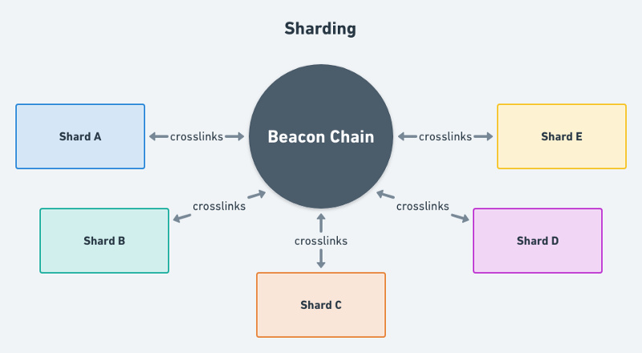

# Phase 1

#### 🏝 **Vitalik对分片的比喻：**

> “Imagine that Ethereum has been split into thousands of islands. Each island can do its own thing. Each of the islands has its own unique features and everyone belonging on that island, i.e., the accounts, can interact with each other and they can freely indulge in all its features. If they want to contact with other islands, they will have to use some sort of protocol”. 
>
> “想象一下：以太坊被划分成数千个岛屿，每个岛屿都在发生着自己的故事，都有着其独特的功能，岛屿上的每个人（即帐户）都可以彼此交互，并且自由地享受岛屿提供的所有功能。如果他们想与其他岛屿接触，则必须借助某种协议。”

📌 **关键词：分片，数据可用性，交联**

 阶段1的实现以阶段0为基础，主要内容是将数据写入分片链。由于阶段0为分片链奠定了大部分基础工作，阶段1实现的复杂程度比其他组件要低得多。

分片链是将来可扩展性的关键，因为其允许并行处理交易而大大提升了吞吐量，目前最新方案是在阶段1中部署64个分片（将来或许会更多）。

阶段1主要涉及在分片链写入数据，并实现其有效性和共识性。分片链尚未拥有账户、资产或智能合约。由于缺乏支持并行处理交易的执行环境，阶段1更像是试运行分片结构，而不是直接借助分片进行扩展的尝试。

🔗 **交联 Crosslink**

每个分片的当前状态（“组合数据根”）会周期性地记录在信标链区块中，作为交联，其中包含自上一个交联以来给定分片中的所有区块。当信标链区块最终确定后，相应的分片区块也将被视为最终确定，如此其他分片可以信任该分片并进行跨分片交易。

交联是：

* 委员会的一个签名集合，作为分片链中某个区块的证明（attestation），证明其可以被添加进信标链中；
* 信标链获取分片链状态更新的主要方式；
* 异步跨分片通信的基础设施。

信标链在各个slot中为每个分片随机分配的验证者，只是就分片区块的内容达成共识，而要证明分片的内容和状态，则需要通过交联。在阶段 2 甚至更高阶段，交联将支持跨分片通信（Cross-Shard Communication）。

## 延伸阅读

* [阶段1规范](https://github.com/ethereum/eth2.0-specs#phase-1)
* [Vitalik简化分片提案](https://notes.ethereum.org/@vbuterin/HkiULaluS)（原版）/[（中文版）](https://news.ethereum.cn/vitalik%ef%bc%9aeth2%e5%88%86%e7%89%87%e9%93%be%e7%ae%80%e5%8c%96%e6%8f%90%e6%a1%88/)

