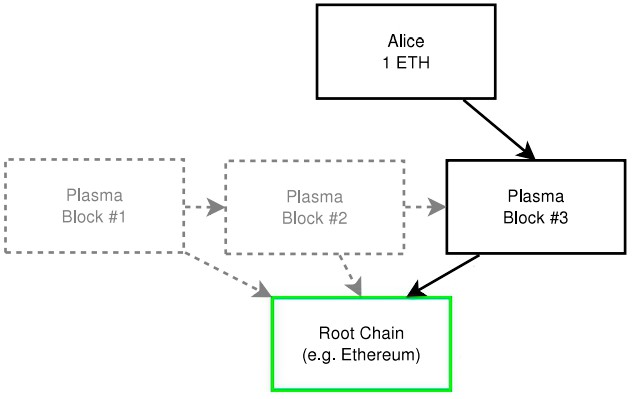
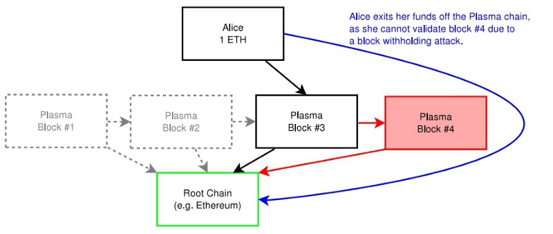

# Plasma

## **什么是Plasma**

Plasma是一种layer2扩容解决方案，由Joseph Poon和Vitalik Buterin在他们的论文《可扩容的自治智能合约》（[_Plasma: Scalable Autonomous Smart Contracts_](https://plasma.io/plasma.pdf)）里第一次被提出。这篇论文为架构可扩容的应用建立了框架。

Plasma结合了智能合约和密码学验证，这个组合通过将交易从以太坊主链转移到“侧链”（有时也称为“子链”或“plasma链”），实现快速而便宜的交易。这些侧链定期给主链汇报，并通过主链来处理争议（几乎像是一个高等法院）。

## **为什么需要Plasma？**

Vitalik Buterin的看法是，在区块链的基础层架构复杂的功能是一个“坏主意”，因为平台会因需要不断讨论、实现、和协调新发现的技术改进而产生高昂的治理费用。把一个新功能添加到基础协议中是一项需要花费大量时间的工作，且会导致以太坊因过载而运行不了。在推进以太坊的工作上，我们不应该仅依赖于基础协议的更改。其认为随着区块链变得越来越成熟，layer1必须趋向稳定，而layer2则将更多地扮演不断创新和变化的角色。

## **Plasma是如何运作的？**

Plasma的结构是建在使用智能合约和默克尔树之上的，使得构建出无数的子链成为可能——它们本质上就是以太坊主链的轻量版本。每条链都单独设计，服务不同的需求，彼此共存且独立运作。在每条子链上都可以搭建更多的链，这就形成了一个树状结构。

### **MapReduce**  

Plasma的白皮书介绍了一种对被称为MapReduce计算的有趣应用。简单来说，MapReduce是一组函数，在组织和计算跨多个数据库的数据上非常有用。

在Plasma的环境里，这些数据库相当于树状结构的区块链，借助MapReduce来对树形区块链中的数据进行验证，从而提高网络效率。

Plasma链上的存款和提款都伴随状态转换，二者都通过欺诈证明来保障。这个设定确保了可执行状态和可交换性，且使得在处理更多交易的同时，基础层中需要加载的数据越少。任何用户都可以互相发送资金，包括那些来自不同参与者集的。这些资金转账可以用原生平台币来支付和提款。

### **欺诈证明\(Fraud Proofs \)**

子链与根链之间的通信安全由欺诈证明提供保障。每条子链都有自己的验证区块机制和特定的欺诈证明实现，它们可以建在不同的共识算法之上。最常见的是工作量证明（Proof of Work）、权益证明（Proof of Stake）、和权威证明（Proof of Authority）。

欺诈证明确保了在受到恶意攻击时，用户可以报告不诚实节点、保护他们的资金、以及退出交易 \(这涉及与主链的交互）。也就是说，通过欺诈证明这一机制，Plasma的一条子链可以对它的父链（或根链）发起投诉。

这些证明使用一个交互式的资金提取协议。为了提取一定数额的资金，需要设定退出时间。在子链上的参与者必须通过要求提款的UTXO（Unspent Transaction Outputs，即未花费交易输出）模型来确认输出。然后，网络参与者可以提交一个经确认和测试的、缴纳了保证金的证明，以证明这些资金确实已花出去。如果发现这个事件是有误的，会把它当作欺诈处理，交易确认会被取消。随后提款人在缴纳了保证金后等待提款。参与者能很快地退出一条错误的Plasma链。在受到攻击的情况下，参与者可以迅速退出并节省费用，确保系统内部的安全性。

 **例子**

例如，如果Alice将一个ETH存在一条Plasma链上，它会被记录在区块上，然而共识是由欺诈证明达成的。之后的操作会在基础链上执行和提交，而她的资金会保存在智能合约里：

## **Plasma的优势与劣势**

毋庸置疑，Plasma是一个不错的扩容解决方案，但Plasma也是有不足的。每一次新的Plasma迭代都揭示了一个需要被解决的新问题，这导致出现了多个Plasma变体，采取不同的方式来进行权衡。我们会在下文详细地比较不同的变体，但首先我们来对比一下Plasma本身及其变体的优势和劣势。

<table>
  <thead>
    <tr>
      <th style="text-align:left">
         &#x4F18;&#x52BF;</th>
      <th style="text-align:left">&#x52A3;&#x52BF;</th>
    </tr>
  </thead>
  <tbody>
    <tr>
      <td style="text-align:left">Plasma&#x5C06;&#x901A;&#x8FC7;&#x628A;&#x64CD;&#x4F5C;&#x79FB;&#x5230;&#x94FE;&#x4E0B;&#x5E2E;&#x52A9;&#x4EE5;&#x592A;&#x574A;&#x533A;&#x5757;&#x94FE;&#x5B9E;&#x73B0;&#x6269;&#x5BB9;</td>
      <td
      style="text-align:left">&#x7531;&#x4E8E;&#x94FE;&#x4E0B;&#x7EC4;&#x4EF6;&#x7684;&#x8FD0;&#x884C;&#x9700;&#x8981;&#xFF0C;Plasma&#x8981;&#x6709;&#x4E00;&#x4E2A;&#x4E2D;&#x5FC3;&#x5316;&#x7684;&#x6784;&#x6210;</td>
    </tr>
    <tr>
      <td style="text-align:left">&#x66F4;&#x4F4E;&#x7684;&#x4EA4;&#x6613;&#x8D39;&#x4E0E;&#x66F4;&#x5FEB;&#x7684;&#x64CD;&#x4F5C;&#x4F7F;&#x5F97;&#x8BA1;&#x7B97;&#x5BC6;&#x96C6;&#x578B;&#x5E94;&#x7528;&#x5F97;&#x4EE5;&#x5728;&#x533A;&#x5757;&#x94FE;&#x4E0A;&#x8FD0;&#x884C;</td>
      <td
      style="text-align:left">&#x63D0;&#x6B3E;&#x7528;&#x6237;&#x7684;&#x7B49;&#x5F85;&#x671F;&#x957F;&#xFF08;7-14&#x5929;&#xFF09;</td>
    </tr>
    <tr>
      <td style="text-align:left">&#x53BB;&#x9664;&#x4E3B;&#x7F51;&#x4E0A;&#x5927;&#x91CF;&#x4E0D;&#x5FC5;&#x8981;&#x7684;&#x6570;&#x636E;&#xFF0C;&#x8FD9;&#x4E5F;&#x964D;&#x4F4E;&#x4E86;&#x8282;&#x70B9;&#x7684;&#x5E26;&#x5BBD;&#x8981;&#x6C42;</td>
      <td
      style="text-align:left">&#x5BF9;&#x4E8E;&#x90A3;&#x4E9B;&#x6CA1;&#x6709;&#x9AD8;&#x989D;&#x8D44;&#x4EA7;&#x4EE5;&#x53CA;&#x4E0D;&#x60F3;&#x7B49;&#x4E0A;&#x6570;&#x5468;&#x6765;&#x8BBF;&#x95EE;Plasma&#x94FE;&#x7684;&#x7528;&#x6237;&#x6765;&#x8BF4;&#xFF0C;&#x4F53;&#x9A8C;&#x6BD4;&#x8F83;&#x5DEE;</td>
    </tr>
    <tr>
      <td style="text-align:left">&#x4E0E;&#x591A;&#x79CD;&#x94FE;&#x4E0A;&#x6269;&#x5BB9;&#x65B9;&#x6848;&#x517C;&#x5BB9;&#xFF0C;&#x5305;&#x62EC;&#x5206;&#x7247;&#x3001;&#x4E0D;&#x540C;&#x533A;&#x5757;&#x5927;&#x5C0F;&#x7B49;</td>
      <td
      style="text-align:left">
        
&#x4E3A;&#x4E86;&#x7EF4;&#x6301;&#x4E0D;&#x53EF;&#x53D8;&#x6027;&#xFF0C;&#x9700;&#x8981;&#x89E3;&#x51B3;&#x65B0;&#x7684;&#x5B89;&#x5168;&#x98CE;&#x9669;/&#x6311;&#x6218;&#xFF08;&#x4E3B;&#x8981;&#x9488;&#x5BF9;&#x9000;&#x51FA;&#x95EE;&#x9898;&#xFF09;

        

           &#x5927;&#x89C4;&#x6A21;&#x9000;&#x51FA;&#xFF1A;&#x5927;&#x91CF;&#x7528;&#x6237;&#x90FD;&#x8BD5;&#x56FE;&#x540C;&#x65F6;&#x9000;
           &#x51FA;&#x4ED6;&#x4EEC;&#x7684;Plasma&#x94FE;&#xFF0C;&#x5927;&#x91CF;&#x4EA4;&#x6613;&#x6D8C;&#x5165;&#x6839;
           &#x94FE;&#x4ECE;&#x800C;&#x5BFC;&#x81F4;&#x7F51;&#x7EDC;&#x62E5;&#x5835;&#x3002;&#x8FD9;&#x53EF;&#x80FD;&#x7531;&#x6B3A;&#x8BC8;&#x6D3B;
           &#x52A8;&#x3001;&#x7F51;&#x7EDC;&#x653B;&#x51FB;&#x3001;&#x4E00;&#x6761;&#x6216;&#x4E00;&#x7EC4;Plasma&#x5B50;&#x94FE;&#x4E0A;&#x5176;&#x4ED6;&#x4EFB;&#x4F55;&#x7C7B;&#x578B;&#x7684;&#x4E25;&#x91CD;&#x4E8B;&#x6545;&#x8BF1;&#x53D1;

        </td>
    </tr>
  </tbody>
</table>


许多Plasma变体都有自身的不足，比如：Plasma MVP有时间限制，这绝不是理想的用户体验，且难以应对网络拥堵问题。Plasma Cash依赖于NFT（non-fungible tokens，非同质代币）来运行，而这需要大量的交易记录。用户必须追踪数据且不断收集未打包证明，因此，当用户转让NFT的所有权时，必须要同时转移它的历史记录。

## **较为主流的Plasma类型**

“Plasma”本身并非某个项目，有许多不同项目使用基于Plasma框架或规范的工具。

目前，主要有四个不同的版本：

**Plasma Cash**

Plasma Cash的设计主要是用于存储和转移NFT。它是高度可扩展的，因为用户只需要追踪他们自己的NFT。该机制使用稀疏默克尔树 \(Sparse Merkle Trees, SMT\) 作未打包证明，因此只可用于NFT，因为SMT使用的是索引。每个代币在每个区块中都有一个“槽”（slot），即唯一存款。当某个代币被花费，交易证明就会记录在区块里所对应的槽中。

**Plasma Debit**

Plasma Debit与Plasma Cash类似，不同点在于每个代币都是用户与链运营者之间的一个支付通道。有点像一个大型闪电网络，但这些通道可以像Plasma Cash代币那样被转移。交易速度非常快，且用户只需追踪自己的通道。

**Plasma Prime**  
Plasma Prime的设计很新颖，使用RSA累加器来解决Plasma Cash里大量历史证明的问题。

**MVP（Minimum Viable Plasma 极简Plasma）**  
Plasma MVP设计是一种极简的、基于UTXO机制的Plasma链。Plasma MVP的基础规范能实现高吞吐量支付交易，但不支持结构更复杂的脚本或智能合约。

Plasma MVP依赖于确认签名，因为处理提款的顺序是基于提款输出的位置。

用户需要在交易前签名，等看到交易被打包进有效区块，再做另一个签名。这些第二个签名也必须被打包在Plasma区块里，为更多的交易减少可用区块空间！

注：确认签名会带来相当糟糕的用户体验。More Viable Plasma, 也以MoreVP为人所知，是Minimal Viable Plasma的一种延伸，它去除了确认签名。MoreVP优化了用户提款的流程。每次提款的顺序将基于创建的输出交易中最新输入的位置。

### **比较不同的Plasma模型**

| Plasma设计 | Plasma MVP | Plasma Cash | Plasma Debit |
| :--- | :--- | :--- | :--- |
| 数据结构 | 二叉默克尔树 | 稀疏默克尔树 | 稀疏默克尔树 |
| 共识 | 任何\(PoW**、**PoA、PoS\) | 任何\(PoW、PoA、PoS\) | 由于支付通道的结构， 倾向于由一个或少数 运营者做选择 |
| 存款 | 基于UTXO，支持ETH和 ERC20 | 每笔存款都有唯一的 代币ID，仅限NFT | 每笔存款都有唯一的代 币ID，仅限NFT和FT |
| 交易费 | 当退出/提款到根链或其 他链时，会产生给验证者 的交易费和gas费 | 与MVP相同 | 用户通过运营者主导的 支付通道来支付而不是 直接支付给其他用户 |
| 签名 | 在打包进区块前需要交易签名， 在打包后需要确认签名 | 确认签名用以避免恶意破坏 | 无须确认签名 |
| 退出/提款 | 退出时需要未花的UTXO证明， 优先次序取决于UTXO的先后 | 代币最新两笔交易的证明、 打包进区块的证明、没有优先次序 | 代币最新两笔交易的证明、 代币未被花费部分的证明、 被打包进区块的证明、没有退出优先次序 |

现在，让我们来对比每个模型的优势、劣势、以及用例。

|  | Plasma MVP | Plasma Cash | Plasma Debit |
| :--- | :--- | :--- | :--- |
| 优势 | 可扩展、所有的签名都发送到 PoA的运营商、高度可置换性 | 高度可扩展、监督人与用户 他们只需要追踪自己的代币， 而不需要追踪链上的所有代币 | 高度可扩展、监督人与用户 他们只需要追踪自己的代币、 NFT和FT的交易都可以进行、 余额更新高效，运营者和持 币者达成共识，而不需要打 包到区块里（与通道相似） |
| 劣势 | 监督人与用户需要监督和挑战 无效的退出、如果运营者扣留 区块或用户试图重新提交交易 可能面临诚实保证金罚没 | 代币证明可以是大量的、代币 的面额是固定的、监督人或用 户自己需要监督和挑战自己代 币的无效交易 | 重度依赖运营者、可以通过 创立一组轮替运营者来规避 风险、要求运营者提前锁定 大量资金来为支付通道提供 资金、交易规模受限于最初 的代币储存规模 |
| 用例 | 低信任用例\(PoA\)、交易所、 证券、P2P支付、 重复支付/账单支付、博彩 | 收藏品、资产管理（房地产、 艺术品） | 对运营者高度信任的用例、 电子钱包或服务供应商、 博彩、资产管理、P2P支付 |

## 
**相关资源**

· [Plasma Group](https://plasma.group/)

·  [什么是以太坊Plasma](https://www.binance.vision/blockchain/what-is-ethereum-plasma)

· [Plasma的状态](https://media.consensys.net/the-state-of-plasma-1-6b48c1e4b295)

·  [Plasma的工作机制](https://medium.com/applicature/what-is-plasma-and-how-does-it-work-15641c95825f)

·  [学习Plasma](https://www.learnplasma.org/en/learn/framework.html)

·  [比较各种Plasma模型](https://www.learnplasma.org/en/learn/compare.html)

## 文章来源

[EthHub](https://docs.ethhub.io/ethereum-roadmap/layer-2-scaling/state-channels/)

[Binance](https://academy.binance.com/en/articles/what-is-ethereum-plasma)

