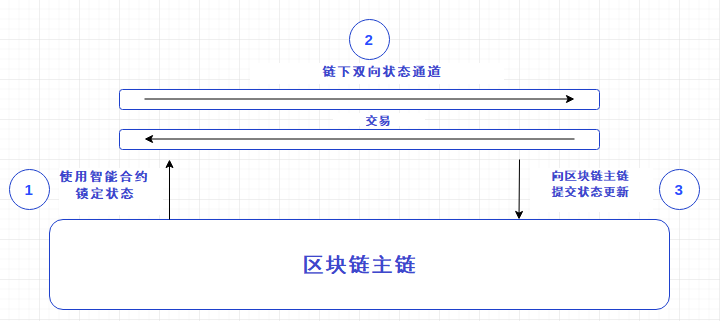

# 状态通道（State Channels）

### 状态通道是什么?

State channels are a very broad and simple way to think about blockchain interactions which could occur on the blockchain, but instead get conducted off of the blockchain, without significantly increasing the risk of any participant. The most well known example of this strategy is the idea of payment channels in Bitcoin, which allow for instant fee-less payments to be sent directly between two parties.

状态通道这一简单且广泛的扩容方案，将发生在区块链上的交互转为链下进行，并且不会增加任意参与者的风险。该策略最著名的应用范例就是比特币的支付通道（payment channels），它允许交易双方之间直接发送即时的、免手续费的支付交易。

State channels are very similar to the concept of payment channels in Bitcoin’s Lightning Network, but instead of only supporting payments, they also support general ‘state updates.’ For example, users could deposit funds into a contract and sign state updates representing moves conducted in a game of Chess. Later, only the final outcome of the game would be broadcasted to the Ethereum network once it's finished. This allows ethereum applications to "move" transactions off-chain, increasing the usefulness of the network as a whole.

状态通道与比特币闪电网络（Lightning Network）中的支付通道概念非常相似，但状态通道不仅支持发送支付，还支持一般的“状态更新（state updates）”。例如，用户可以在合约中存入资金，然后对状态更新进行签名，这一行为就像国际象棋中的走法。之后，只有游戏结束后，游戏的最终结果才会被广播到以太坊网络上。这允许以太坊应用程序将交易“转移”到链下，增加了整个网络的有用性。

### Who is working on State Channels?状态通道的团队有哪些？ 

Teams currently working on State Channels are: [_CelerX_](https://celerx.app/) __[Connext Network](https://connext.network/) [_State Channels_](https://statechannels.org/) __[Perun](https://perun.network/)

目前状态通道的团队有：[_CelerX_](https://celerx.app/) _、_[Connext Network](https://connext.network/)、 [_State Channels_](https://statechannels.org/) _、_[Perun](https://perun.network/)。

### How do State Channels work?状态通道的工作原理是什么？ 

State channels work by “locking up” some portion of blockchain state into a multisig contract, controlled by a defined set of participants. The state that is “locked up” is called a state deposit. For instance, this might be an amount of ether or an ERC20 token, but could also be a cryptokitty or an ENS domain name.

状态通道的工作原理是将区块链状态的某些部分 "锁定 "到一个多签名合约中，由一组确定的参与者控制。而被 "锁定 "的状态被称为“状态存款”。例如，这可能是一笔ETH或ERC20代币，但也可能是NFT加密猫或ENS域名。

After the state deposit is locked, channel participants use off-chain messaging to exchange and sign valid ethereum transactions without deploying them to chain. These are transactions that could be put on chain anytime, but are not.

锁定状态存款之后，通道参与者在链下进行交换以及对有效的以太坊交易进行签名，而不将其部署到链上。虽然这些交易随时可以放到链上，但状态通道将其放到链下处理。

A basic breakdown:

图示为状态通道的基本演示：

1. Part of the blockchain state is locked via multisignature or some sort of smart contract, so that a specific set of participants must completely agree with each other to update it.
2. Participants update the state amongst themselves by constructing and signing transactions that could be submitted to the blockchain, but instead are merely held onto for now. Each new update “trumps” previous updates.
3. Finally, participants submit the state back to the blockchain, which closes the state channel and unlocks the state again \(usually in a different configuration than it started with\).

1. 区块链的部分状态是通过多重签名或某种智能合约锁定的，因此特定的一组参与者必须完全同意对方才能更新状态。 
2. 参与者通过创建交易和对交易进行签名来更新状态，这些交易可以直接提交到区块链上，但到这步为止先保留在链下。每一次新的更新都会 "胜过"之前的更新（即覆盖了之前的更新）。 
3. 最后，参与者将状态提交回区块链，然后区块链会关闭状态通道并再次解锁状态（通常与开始时的配置不同）。

Since all exchanged transactions are equally valid as far as the blockchain is concerned, state channels need a mechanism to ensure that the latest off-chain state \(i.e., the latest move in our chess game\) is the one that ultimately gets settled on the main chain. Thus, if a party attempts to unilaterally close a channel, other parties in the channel have a period of time — a "dispute window" — in which they have an opportunity to submit a more recent state, thereby proving that fraud was attempted. Once an infraction is proven, the contract handles the resolution process, which typically involves punishing the guilty party by slashing their deposited funds \(though one could also simply update to the valid state and proceed accordingly\).

由于就区块链而言，所有已交换的事务都是同等有效的，所以状态通道需要一种机制来确保最新的链下状态\(即象棋游戏中的最新一步\)是最终在主链上确定的状态。因此，如果一方企图单方面关闭一个通道，该通道的其他各方有一段时间- -一个“争端窗口”- -在这段时间内它们有机会提交较新的状态，从而证明有人企图欺骗。一旦证实违规，合约就会处理解决过程，这通常包括通过罚没违规参与者的存款来惩罚他们（尽管也可以简单地更新到有效状态并相应地进行）。

If the “state” being updated between participants was a digital currency balance, then we would have a payment channel. Steps 1 and 3, which open and close the channel, involve blockchain operations. But in step 2 an unlimited number of updates can be rapidly made without the need to involve the blockchain at all — and this is where the power of state channels comes into play, because only steps 1 and 3 need to be published to the network, pay fees, or wait for confirmations. In fact, with careful planning and design, state channels can remain open almost indefinitely, and be used as part of larger hub and spoke systems to power an entire economy or ecosystem.

如果参与者之间更新的“状态”是数字货币余额，那么我们将拥有一个支付通道。 打开和关闭通道的步骤1和步骤3，涉及区块链上的操作。但在步骤2中一个无限数量的更新可以迅速而不需要涉及到区块链——这就是状态通道发挥作用的地方，因为只有步骤1和3需要被发布到网络、支付费用，或等待确认。事实上，经过精心的规划和设计，状态通道可以几乎无限期地保持开放，并被用作更广泛的用途，为整个经济或生态系统提供动力。

### Difference between State Channels and Sidechains状态通道和侧链之间的区别 

#### State Channel pros状态通道的优点 

* State channels have strong privacy properties: This is because everything is happening “inside” a channel between participants, rather than broadcast publicly and recorded on-chain. Only the opening and closing transactions must be public. Whereas in sidechains every transaction is published on the sidechain which is received by every participant on the sidechain irrespective of the fact that you are not interacting with all of the participants on the sidechain.
* 状态通道的隐私性很强：这是因为所有交易都是在参与者双方的通道内发生的，而不需要广播以及在链上记录。只有开盘和收盘交易必须公开。而在侧链中，每笔交易都必须发布到侧链上，并且侧链上的每位参与者都会接受到这些交易，尽管用户并没有与侧链上的所有参与者进行交互。
* State channels have instant finality, meaning that as soon as both parties sign a state update, it can be considered final. Both parties have a very high guarantee that, if necessary, they can “enforce” that state on-chain.
* 状态通道可以即时敲定状态，这意味着一旦双方对某一状态更新进行了签名，它就可以被认为是最终状态。如果有必要，通道双方都可以保证“强制”在链上处理状态。

#### State Channel cons状态通道的缺点 

* State Channels need 100% availability of all the participants involved: As we have discussed above that if anyone the participants goes unavailable, then this could prove costly to him. The participants can use a third party service to represent him if he goes unavailable \(see, for instance, [http://hackingdistributed.com/2018/05/22/pisa/](http://hackingdistributed.com/2018/05/22/pisa/)\), but the possibility of the representative getting attacked or bribed makes it a problem for state channels. Whereas in sidechains you don’t have to be available all the time you are on the sidechain.
* 状态通道里，要求其参与者提供100%的可用性：正如上文所讨论的那样，如果任意参与者无法提供可用性，那么使用状态通道对他来说代价很高。当然，如果参与者无法提供可用性，参与者可以委托第三方服务代表，（例如，参见[http://hackingdistributedcom/2018/05/22/pisa/](http://hackingdistributed.com/2018/05/22/pisa/)\)，但是代表可能受到攻击或贿赂，这对状态通道来说是个问题。而使用侧链，则不需要一直提供可用性。
* State channels are best used for applications with a defined set of participants: This is because the state deposit contract\(the contract used to lock the state\) must always know the participants/entities \(i.e. addresses\) that are part of a given channel. We can add and remove people, but it requires a change to the contract each time. Whereas in sidechains there is no such limitation on the movement of the participants.
* 状态通道最适合于那些拥有一组确定的参与者的应用程序：这是因为状态存款合约（即用于锁定状态的合约）必须始终知道属于某个特定通道的参与者/实体的地址。我们可以增减参与者，但是每次都需要对合约进行更改。而在侧链中，对参与者的改变则没有这样的限制。
* State Channels are particularly useful where participants are going to be exchanging many state updates over a long period of time: This is because there is an initial cost to creating a channel in deploying the state deposit contract. But once it is deployed, the cost per state update inside that channel is extremely low.
* 当参与者在未来很长一段时间内需要交换多次的状态更新时，状态通道尤其有用：这是因为在部署状态存款合约时，创建通道会有初始成本。但是一旦部署了通道，在通道内发生的每一次状态更新的成本是非常低的。

#### Sidechain pros侧链的优点 

* Sidechains are permanent. You don’t have create your own sidechain for specific purpose if there is one present: Sidechains are created and maintained once made. We don’t close sidechains, rather we lock the assets on sidechain to move back to the mainchain. This can be helpful in the way that anyone who is doing a specific task off blockchain/mainchain \(for eg. transacting in dogecoin\)will come to the same sidechain.

  So, you don’t have to create separate chains for every new participant. Whereas in state channels, an on-chain operation is required to add a participant to an existing channel. But projects such as Raiden network, and more generally the technique of meta-channels, offer a partial solution to this. They create a mesh of participants so you don’t have to create a new channel for every new participant you interact with. You can interact with participants indirectly creating a channel between you and recipient through some other participant who is common to both: you and the recipient. 侧链是永久性的。如果已有一个侧链存在，用户不必为特定目的创建自己的侧链：侧链一经创建，就会一直维护着。我们不会关闭侧链，而是将侧链上的资产锁定后再移回主链。这样做很有好处，因为任何人在链下处理特定的任务（如通过狗狗币交易）时，将会到同一条侧链上。因此，不必为每个新参与者创建单独的链。而在状态通道中，需要通过链上操作将参与者添加到现有通道中。但是像Raiden network这样的项目，以及更普遍的元通道技术，提供了这个问题的部分解决方案。它们创建了一个参与者网格，因此用户不必为每个与其交互的新参与者创建一个新通道。也就是说，用户可以与参与者间接交互，通过其他参与者（这些参与者与用户自身以及接收者都有联系）在用户自身和接收者之间创建一个通道。

* Sidechains allow cryptocurrencies to interact with one another: They add flexibility and allow developers to experiment with Beta releases of Altcoins or software updates before pushing them on to the main chain. Traditional banking functions like issuing and tracking ownership of shares can be tested on sidechains before moving them onto main chains.
* 侧链允许加密货币之间相互交互：它们增加了灵活性，允许开发者在将山寨币或软件更新推送到主链之前对测试版进行试验。发行以及跟踪股票所有权等传统银行功能可以在将其运用到主链之前在侧链上进行测试。

#### Sidechain cons侧链的缺点 

* Sidechains do not benefit from the security of the main-chain. A user interacting on a side-chain must trust the security properties of that sidechain, because if it compromised or malevolent, a user has no guarantee of withdrawal to the main-chain. In contrast, participants in a state channel can always return to the main-chain so long as they follow the protocol.
* 侧链不能从主链的安全性中获益。在侧链上进行交互的用户只能依靠该侧链的安全性，因为如果侧链遭到恶意破坏，则无法保证用户可以安全地退出到主链。相反，状态通道中的参与者只要遵守协议，他们可以随时退出到主链上。
* Sidechains need a lot of initial investment to start off: To create a sidechain we need to have enough miners so that the network is safe from attackers. Also, we have to make sure that they are up and running. Whereas there is no blockchain involved in state channels. So, no such requirement is needed.
* 侧链需要大量的初始投资：为了创建侧链，我们需要有足够的矿工，这样才能保证网络的安全。 同时，我们必须确保它们能够正常运行。而状态通道中不涉及区块链上的操作，所以，不需要这样的要求。
* A Federation is needed for sidechains: This adds another layer between the mainchain and the sidechain. This could prove as another weak point for the attackers to attack by bribing or attacking the federation. Whereas in state channel we just need a smart contract to do this for us.
* 侧链需要一个联盟（Federation）：这在主链和侧链之间增加了另一层。攻击者可以通过攻击或者贿赂Federation来攻击侧链。而在状态通道中，我们只需要一个智能合同来做这些。

### Resources参考来源 

* [State Channels - an explanation](https://www.jeffcoleman.ca/state-channels/)
* [Making Sense of Ethereum's Layer 2 Scaling Solutions \(Josh Stark\)](https://medium.com/l4-media/making-sense-of-ethereums-layer-2-scaling-solutions-state-channels-plasma-and-truebit-22cb40dcc2f4)
* [State Channels Blog](https://blog.statechannels.org/)

