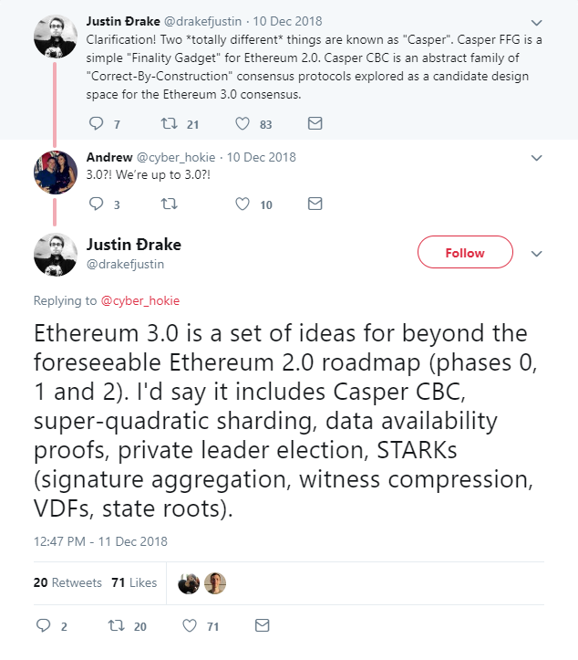

# ETH 3

当Vitalik被问到什么是ETH3.0时：

"STARKS, STARKs and lots of STARKs" -- Vitalik, Jan, 2019

[Justin Ðrake](https://twitter.com/drakefjustin)在以色列Ethereal Tel Aviv会上提出了ETH3.0相关概念，他在twitter上[说到](https://twitter.com/drakefjustin/status/1072593728253104128)：

> it includes Casper CBC, super-quadratic sharding, data availability proofs, private leader election, STARKs \(signature aggregation, witness compression, VDFs, state roots\). 
>
> ETH 3.0 预计将包含 Casper CBC、超二次分片、数据可用性证明、私密领导人选举、STARK \(签名聚合、见证压缩、VDF可验证延迟函数、状态根\) 等超越 ETH 2.0 路线图的概念。

### 

### 参考资源

Justin Drake在StakeWare上的演示文稿



