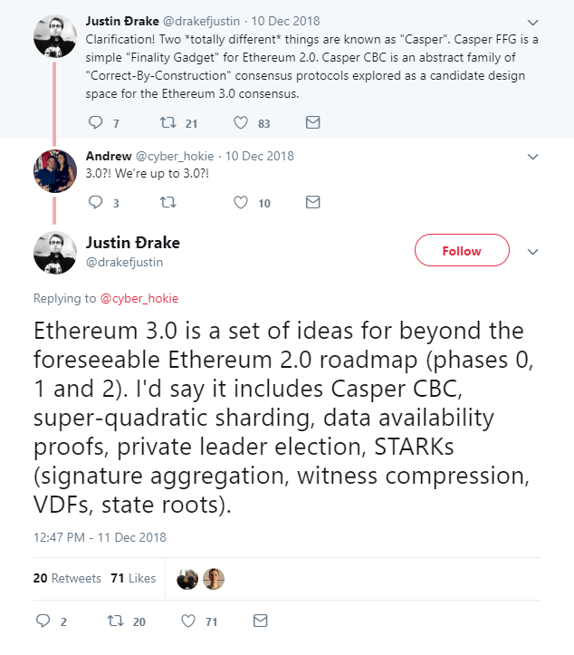

# ETH3

### ETH3.0概念提出

当Vitalik被问到什么是ETH3.0时，

"STARKS, STARKs and lots of STARKs" -- Vitalik, Jan, 2019

[Justin Ðrake](https://twitter.com/drakefjustin)在以色列Ethereal Tel Aviv会上提出了ETH3.0相关概念，他在twitter上[说到](https://twitter.com/drakefjustin/status/1072593728253104128)：

> it includes Casper CBC, super-quadratic sharding, data availability proofs, private leader election, STARKs \(signature aggregation, witness compression, VDFs, state roots\).



Justin Drake Talk on Ethereal Tel Aviv



