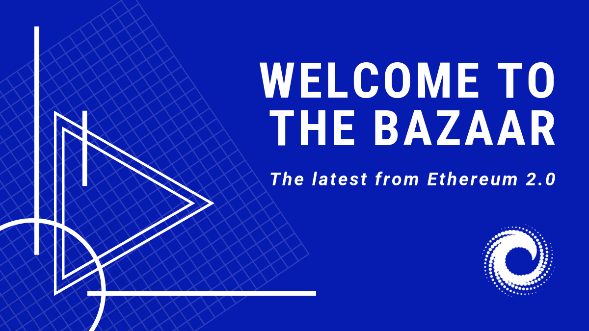

# Ethereum 2.0’s Latest Strides Forward

## Ethereum 2.0’s Latest Strides Forward

[Ben Edgington](https://media.consensys.net/@benjaminion?source=post_page-----13f63652e57d----------------------)[Follow](https://medium.com/m/signin?operation=register&redirect=https%3A%2F%2Fmedia.consensys.net%2Fethereum-2-0s-latest-strides-forward-13f63652e57d&source=post_page-dd1bfec82509----13f63652e57d----------------------)[Jul 27](https://media.consensys.net/ethereum-2-0s-latest-strides-forward-13f63652e57d?source=post_page-----13f63652e57d----------------------) · 11 min read

> The phase 0 spec is frozen. Clients are testing interop. Phase 2 research has exploded. What does all this mean for the future of Ethereum?

Welcome to the Bazaar

I recently re-read Eric Raymond’s [classic 1997 essay](http://www.catb.org/~esr/writings/cathedral-bazaar/cathedral-bazaar/index.html?source=post_page---------------------------) on open source development, “The Cathedral and the Bazaar.” It’s a compelling look at what happens when you allow a broad group of “all-comers” to participate in the development of a software project. He calls this the “bazaar” model of open source software development. It is noisy and seemingly chaotic, but immensely productive and energising — and, crucially, results in better outcomes. He contrasts the bazaar approach with a more traditional “cathedral” model in which all development is done by a small, closed group of individuals. Twenty-something years later, the power of the bazaar is [undeniable](https://opensource.com/life/16/5/19-years-later-cathedral-and-bazaar-still-moves-us?source=post_page---------------------------). The Linux operating system that now [dominates](https://en.wikipedia.org/wiki/Usage_share_of_operating_systems?source=post_page---------------------------#Market_share_by_category) much of the world’s computing is but one example of the software development bazaar in action.

I’ve found this an interesting lens through which to view the development of the Ethereum 2.0 blockchain. A year on from the inception of the Ethereum 2.0 project in its current form feels like a good time for reflection.

The Ethereum 2.0 project has very much adopted the open, bazaar-like style of development. However, we are significantly upping the stakes on Raymond’s vision: in Ethereum 2.0, we’re not just building software; we’re designing an entire protocol in this radically open way. I’m not sure that anything quite like this has been tried before.

It’s not anarchy. In line with Raymond’s concept, the work is largely led by a small team from the Ethereum Foundation which sets the pace and manages the main repository. But everything is being done [transparently](https://blog.ethereum.org/2019/05/21/ethereum-foundation-spring-2019-update/?source=post_page---------------------------) and openly, with the broadest possible participation. Sixty-two people have contributed to [the specification](https://github.com/ethereum/eth2.0-specs?source=post_page---------------------------), many more are involved in the nine client implementations in progress, others in R&D discussion on the [ethresear.ch](https://ethresear.ch/?source=post_page---------------------------) site, others still on the fortnightly developer calls \(over fifty on a recent call\), to name just some examples.

Yes, the process has sometimes appeared chaotic, disorganised, inefficient. There have been lots of redesigns, revisions, and rewrites. Yet, out of all the bazaar-like tumult, something wonderful is emerging. Something extraordinary. Something that less open developer communities will struggle to compete with.

I’ve [argued](https://notes.ethereum.org/c/Sk8Zs--CQ/https%3A%2F%2Fbenjaminion.xyz%2Fnewineth2%2F20190208.html?source=post_page---------------------------), and will continue to argue, that this development model is Ethereum’s superpower. Radical openness engenders an immense level of engagement and buy-in from the community. For a technology like ours that relies fundamentally on community-driven “network effects”, this is vital. This engagement alone sets Ethereum apart from many others.

Here’s one example of this superpower at work that I often ponder, and Vitalik recently [tweeted about](https://twitter.com/VitalikButerin/status/1146629103648305154?source=post_page---------------------------): it’s striking how often, when a need has arisen, someone has simply stepped up to address it. At the end of 2017, Justin Drake appeared on the scene and re-invigorated the Ethereum 2.0 research effort after it had been fallow for a while. In mid-2018, there was a clear need for better coordination and planning: Danny Ryan stepped up. In early 2019, Diederik Loerakker [appeared](https://twitter.com/protolambda/status/1091526195215257601?source=post_page---------------------------) from nowhere to take on the critical role of creating client test suites for Ethereum 2.0. Our next challenge is peer-to-peer networking expertise, and already, people are getting involved. I could give dozens more examples, but the point is made. People love the bazaar.Do bazaars have roadmaps? _\[credit_ [_Microsoft_](https://templates.office.com/en-us/colorful-product-roadmap-timeline-tm16411242?source=post_page---------------------------)_\]_

An interesting question I sometimes get asked, usually by businesses interested in Ethereum, is: _where’s the roadmap?_ It’s fair to say that, while there is very much a shared understanding among those involved of where we’re going and how we’ll get there, there simply isn’t such a thing as a published, detailed, committed, “officially sanctioned” roadmap. Bazaars don’t really have “proper” roadmaps. An old-but-gold [article from Linux Weekly News](https://lwn.net/Articles/114804/?source=post_page---------------------------) wrestles with the same issue. Their conclusion: “Trying to impose a roadmap on this process is unlikely to improve it.”

Having said that, a reminder that there _is_ a plan to deliver the Ethereum 2.0 system in three separate phases, each building on the previous phase. Phase 0 is the [beacon chain](https://media.consensys.net/state-of-ethereum-protocol-2-the-beacon-chain-c6b6a9a69129?source=post_page---------------------------), which implements the Proof of Stake protocol, an alternative to Proof of Work for securing the blockchain network. Phase 1 provides massive scalability in the form of shard chains, increasing the transaction handling capacity of the network by over a thousand. Phase 2 is the execution layer that will provide user accounts and smart contracts, and support the full array of distributed applications necessary for our decentralised future.

## The Beacon Chain \[Phase 0\] 

After exactly a year of the intensive development described above, the Ethereum 2.0 beacon chain specification was frozen on the 30th of June: the research and the design are finished; we are fully into the delivery stage.

The beacon chain is the foundation of the Ethereum 2.0 system. It is responsible for managing the proof-of-stake protocol and coordinating all of the independent parallel shards, and is the most complex part of the development. If you are new to the beacon chain or need a refresher, I’ve written about it in [a previous blog post](https://media.consensys.net/state-of-ethereum-protocol-2-the-beacon-chain-c6b6a9a69129?source=post_page---------------------------).

The beacon chain was conceived in Berlin in July last year as the future direction of Ethereum 2.0 \(I’ve [written about this](https://media.consensys.net/state-of-ethereum-protocol-1-d3211dd0f6?source=post_page---------------------------) as well\). Beginning with a more-or-less blank sheet of paper, but weaving in ideas that go back to the very earliest days of Ethereum, the specification has been [thrashed out](https://github.com/ethereum/eth2.0-specs/graphs/code-frequency?source=post_page---------------------------) through an iterated process of insight, discussion, review and testing.

In parallel, no fewer than [nine teams](https://docs.ethhub.io/ethereum-roadmap/ethereum-2.0/eth2.0-teams/teams-building-eth2.0/?source=post_page---------------------------) from various backgrounds and places have been implementing the specification in different programming languages, while adding the engineering infrastructure that makes it all run \(networking, databases, tooling — the specification is the engine but we need to add quite a lot else to get a fully functioning vehicle\). Some teams have already launched public proof-of-concept test nets that allow people to get a taste of being a validator in Ethereum 2.0, such as the one from [Prysmatic Labs](https://medium.com/prysmatic-labs/ethereum-2-0-phase-0-testnet-release-1e9e682db910?source=post_page---------------------------).

At times, the spec has changed rapidly, and we’ve been racing to keep up. The recent freezing of the spec is an important milestone, with two nice consequences.

The first is that the specification can now be subject to formal verification. This involves translating it to a special purpose language [called K](https://runtimeverification.com/k/?source=post_page---------------------------) that allows for rigorous analysis and proofs of correctness. Runtime Verification will be [doing this work](https://twitter.com/RosuGrigore/status/1131066228460675072?source=post_page---------------------------). They have already completed [an analysis](https://runtimeverification.com/blog/formal-verification-of-ethereum-2-0-deposit-contract-part-1/?source=post_page---------------------------) of the validator deposit contract that will be deployed on Ethereum 1.0 to onboard validators into Ethereum 2.0.

The second consequence of the spec freeze is that it allows all the clients to catch up to exactly the same point and begin the next critical stage: interoperability. Ethereum 2.0 beacon chain clients are analogous to current Ethereum nodes such as Geth, Parity, and Pantheon. These nodes run the network. They communicate with each other and it is critical that they agree at all times. Any disagreement, perhaps due to a bug, however small, results in [a network split](https://www.ccn.com/ethereums-blockchain-accidentally-splits/?source=post_page---------------------------).Working together on interoperability in Brooklyn _\[picture by the author\]_

Achieving interoperability is a journey in itself. To start with, all the clients need to pass the common reference tests. A very interesting feature of the specification is that it has been made _executable_ — it is possible to run the spec itself in order to generate the client tests directly. Some [would prefer](https://twitter.com/DeanEigenmann/status/1145719313002901504?source=post_page---------------------------) a more narrative style to the specification, but, nonetheless, this is a very useful facility. Another type of testing that has been very successful in tracking down issues with Ethereum 1.0 clients in the past is “fuzz testing”. This is where clients are repeatedly fed randomly broken data in order to find corner cases where they behave incorrectly. Tools for this are being developed for the beacon chain.

Once each client team is confident that its implementation behaves correctly, the next step is to start them talking to each other over a network. It’s hard to diagnose distributed systems when things go wrong. So, as an initial step, clients are implementing a [simplified protocol](https://github.com/deltap2p/hobbits?source=post_page---------------------------) that will be easier to debug and analyse, before going on to implement the full networking stack. The plan is for all the client teams to get together in a remote corner of Ontario in early September for a “lock-in”: nobody leaves until all the client implementations are interoperating correctly.

Interoperability paves the way for a joint, long-lived, public testnet later this year. Anyone who wishes to join will be able to install the client software of their choice, stake testnet Ether, and participate in validating the network. Or trying to break it. Bounties could be offered to anyone discovering bugs and flaws.

Finally, all being well, the beacon chain will start up in early 2020. A date of January 3rd has been suggested, being the anniversary of the Bitcoin genesis block. But that is perhaps too soon to be completely [production ready](https://github.com/ethereum/eth2.0-pm/issues/53?source=post_page---------------------------). A little later in Q1 2020 is most likely.

One last step before the beacon chain can start up is deploying the validator deposit contract onto the existing Ethereum 1.0 chain. The deposit contract is where anybody wishing to run a validator will register their 32 Eth stake. The plan is to deploy the contract in a ceremony at DevCon V in early October this year. Once the deposit contract has received around two million ether, representing sixty-five thousand validators, we can start the beacon chain with confidence that it will be secure against attack.

## The Shard Chains \[Phase 1\] 

Although delivery of Ethereum 2.0 is planned as sequential phases, work on each phase is progressing in parallel.

Phase 1 is the design and delivery of the sharded data chains. This is where we add 1024 independent blockchains to the system, each hanging off the beacon chain. The protocol for this phase is much simpler than the beacon chain, and the \(mostly complete\) specification amounts to only about half as many lines in total.Ethereum 2.0 will be a peer-to-peer network of an unprecedented scale _\[credit_ [_Daniel Aleksandersen_](https://www.ctrl.blog/entry/how-to-server-seeding-dht-torrents.html?source=post_page---------------------------) _License_ [_CC BY 4.0_](https://creativecommons.org/licenses/by/4.0/?source=post_page---------------------------)_\]_

The main challenge for Phase 1 is the peer-to-peer network engineering required to get the right information to and from the right validators quickly enough when they are split across these 1024 chains. Work on this is [already underway](https://github.com/ethereum/eth2.0-specs/pull/1281) alongside the client interoperability activity.

## The Execution Layer \[Phase 2\] 

The most exciting recent development has been the emergence of a clear way forward for the final stage of the delivery of Ethereum 2.0: the execution layer. As someone who writes sometimes, I know full well the challenge presented by a blank sheet of paper. When the design space is huge and unconstrained, it is very hard to know how to get started. So it has been for the design of the Ethereum 2.0 execution layer.

Until a few weeks ago, nobody was quite sure where to start: what kind of programs will we be able to run on Ethereum 2.0? What will users’ accounts look like? How will the shards intercommunicate? There was no shortage of ideas; the possibilities are endless. But a clear way forward was elusive.

The impasse was broken by Casey Detrio, who gave a very nice, brief summary of the history in a [presentation](https://www.youtube.com/watch?v=RW7K3JQOZOg&t=6324&source=post_page---------------------------) at the Scaling Ethereum conference in Toronto. He published [a suggested approach](https://ethresear.ch/t/phase-one-and-done-eth2-as-a-data-availability-engine/5269?source=post_page---------------------------) that has proved to be very fruitful. Casey’s suggestion was picked up and developed further by Vitalik, and others have enthusiastically stepped in to prototype and define it further.

On the current Ethereum blockchain, there is a single execution environment, the Ethereum Virtual Machine \(EVM\). It is written into the protocol that every smart contract must be executed only by the EVM, that execution is charged for in a certain way \(transaction gas\), that only certain cryptographic signatures and replay-protection schemes are allowed. While the EVM is extremely capable, all of this leads to limitations: the need to fund accounts with ether even if we want only to send some ERC20 token; the difficulty of implementing truly anonymous transfers; the expense of using interesting new cryptographic techniques.

In a nutshell, the proposal for Ethereum 2.0 is to “abstract” all of this away. The blockchain itself will not mandate any of these mechanisms, instead it will provide for a number of different execution environments \(EEs\), each of which is able to operate under its own rules, optimised for its own purposes.

For example, in addition to a general-purpose execution environment providing for smart contracts compiled into [eWASM](https://nirolution.com/ethereum-ewasm/?source=post_page---------------------------), there could be EEs optimised for anonymous token transfers, EEs for new types of smart contract languages such as something [Haskell-like](https://sites.google.com/consensys.net/fae?source=post_page---------------------------), EEs optimised for handling high-capacity Plasma chains, EEs specifically tailored to enterprise users, with permissioning and privacy features. There could even be an EE that implements Facebook’s [Move](https://developers.libra.org/docs/assets/papers/libra-move-a-language-with-programmable-resources.pdf?source=post_page---------------------------) virtual machine from its recently announced Libra blockchain.

I’m going to leave the detail to a future article — it all remains under rapid development, and this article is quite long enough already. I will mention, however, one very significant result of this new model for Phase 2. It has long been an aspiration to take the whole of the current Ethereum 1 blockchain and implement it as a shard within Ethereum 2.0. This would assure the future for current Ethereum applications, and allow us eventually to switch off Proof of Work entirely. We now have a practical way to do this, and it is moving from mere aspiration to something like a plan. “Eth1 on Eth2” doesn’t need to be implemented from the start of Ethereum 2.0, it can be added later, so there is time yet to firm this up.

## Round up 

It’s busy in the bazaar \[credit Diego Delso, [delso.photo](http://delso.photo/?source=post_page---------------------------), License [CC-BY-SA](https://creativecommons.org/licenses/by-sa/4.0/legalcode?source=post_page---------------------------)\]

At the current rate of progress, I am more optimistic than ever about the future of Ethereum 2.0. I don’t like to over-state things, but I’m beginning to wonder if the final phase of delivery, phase 2, could even go live during 2020, somewhat earlier than originally estimated. Best not to quote me on this.

There remains plenty to do between here and there, but the route is clearer than it has ever been, and engagement is strong and growing. The energy of the bazaar is tremendous: it is a thrilling place to be, and I am convinced that, by engaging so many brilliant and motivated people, the end result will be outstanding.

The bazaar is open to all: Why not [get involved](https://github.com/PegaSysEng/artemis/issues?q=is%3Aissue+is%3Aopen+label%3A%22help+wanted+%F0%9F%86%98%22)?



