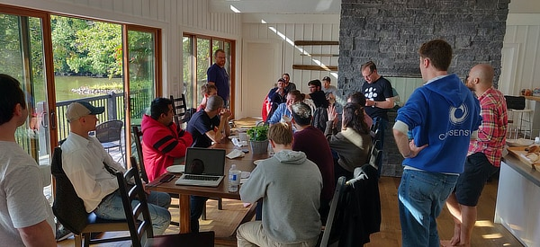

# ETH2 双周刊

在过去的三周里，有关 Eth2 的新闻消息都异常平静。但该现象的原因意义十分重大：所有人都完全专注于**客户端互操作性封闭研讨会（Interop Lock-in）。**

## **客户端互操作性封闭研讨会**

前两周，除了一个团队外，其他所有以太坊2.0客户端开发团队都聚集在安大略省的偏远地区，讨论如何使信标链节点能够互相沟通。加入我们的还有以太坊基金会、Whiteblock 团队和以太坊2.0阶段2的研究人员（ConsenSys 的 Quilt 团队和 EF 的 Ewasm 团队）。

在此我就不赘述整个讨论过程了。要了解详细过程，可以查看 Danny Ryan 在以太坊基金会的博客上发表的回顾文章\[1\]，我也就此在ConsenSys的博客上发表了一篇文章。总的来说，这次讨论的成功大大超乎了我们的预料。

**在此给大家分享一些推特上的高光时刻：**

特别需要提到 Parity 团队的 Wei Tang，他没能来现场，但依旧成功地实现了 Shasper 客户端与 Lighthouse 客户端之间的通信

我把这次聚会的一些照片做成了一个相册，放在这个网址了\[2\]。

## **以太坊2.0实现者会议**

第25次通话于9月19号进行。

* 会议议程；\[3\]
* 会议视频；\[4\]
* 我的速记 \[5\] 和 Pooja Ranjan 的详细笔记 \[6\]。

这次通话很快就结束了，只耗时45分钟。我认为每个参与者在这次互操作性讨论会后都很疲惫，需要在举办 DevCon 之前稍作调整。

值得注意的是：**规范版本0.8.4将在未来几天发布。**将包括网络规范更新，以及一些特殊测试向量 \[7\]，以修复在互操作期间发生的一些共识故障。**核心规范仍处于冻结状态，预计不会有所更改。**

## **BLS 签名方案标准化**

以太坊2.0 将使用的 BLS 签名方案的标准化工作 \[8\] 是一个尚未被广泛讨论的重要主题。与以太坊2.0一样，好几个下一代区块链（如Algorand、Chia、Dfinity），也计划在 BLS12-381 曲线上使用 BLS 签名。在未来采用一种通用方法来促进互操作性是非常有意义的。

**如今，以太坊2.0 客户端正在使用的 BLS 签名实现与提议标准有所不同。**特别是关于将哈希映射到曲线上的算法 \(将待签名数据映射到椭圆曲线上某个点的方法\)。

Sigma Prime 的 Kirk Baird 已开始起草 Eth2 BLS 规范的更新计划 \[9\]。目前我们执行 hash-to-curve 算法（“try and increment”技术）的方法非常简单。**不幸的是，它并没有成为标准，主要是因为该方法并不是常量时间。**常量时间并不是ETH2.0中必要的特性——所有转换为哈希值的输入信息都是公开的。然而，**我们需要执行新的 BLS 签名算法，以符合新的 hash to curve 标准 \[10\]。**

作为参考，我用 Java 实现了这个新方案，它通过了所有的测试向量 \[11\]。Kirk 也正在开发一个 Python 版本的实现 \[12\]。与我们当前的 Java 版本相比 \[12\]，在不包括测试的前提下，我的实现版本多出了50倍代码行。

这些待完成工作的一个明显影响就是，**在以太坊1.0链上部署验证者押金合约（Validator Deposit contract）\[13\] 的计划可能会延迟。**最初的计划是在 DevCon 会议期间部署验证者押金合约，现在看来不太可能实现。原因是一部分验证者注册过程涉及生成 BLS 签名：在该方案标准冻结之前，我们无法确定登记流程不会被更改。然而，**我们应该能在几周内做好准备，使得明年第一季度的信标链启动计划如期进行。**

## **其他研究**

简单地介绍两件事。

Vitalik 对以太坊阶段2的实现方式有了一些不同的想法 \[14\]。研究阶段2的团队在互操作性讨论会期间对此进行了深入的讨论。在对此发表意见之前，我需要先进行消化。

Ryuya Nakamura也一直在思考针对 Casper FFG 的攻击。通过对 FFG 的 Flip-flop 攻击进行分析 \[15\]，他发表了相关文章：_《针对 FFG bouncing 攻击的分析》_\[16\] 以及_《FFG 如何抵御 bouncing 攻击》_\[17\]。

## **其他新闻**

近来事务繁杂，如有遗漏，敬请海涵。

* 除了实现互操作性以外，Lighthouse和Prysm客户端都更新了。\[18\]\[19\]
* Lighthouse客户端团队成员 Mehdi 在 EthBerlin 会议期间的演讲PPT：_《以太坊2.0的性能与安全性》_\[20\]。
* David Hoffman在推特上分享了 Ethereal 特拉维夫峰会上 Vitalik 的问答内容 \[21\]。其中不乏关于以太坊2.0的干货。
* Colin Schwartz 在 Medium 上发表文章：_《以太坊2.0：Ewasm的全面向导》_\[22\]。
* Julin Chiu 对 Casper FFC 的解释性文章：_《Casper FFG：实现 PoS 的共识机制》_\[23\]。

本文涉及的链接：

\[1\]:https://blog.ethereum.org/2019/09/19/eth2-interop-in-review/

\[2\]:https://photos.app.goo.gl/djJrUreWytBbkYhcA

\[3\]:https://github.com/ethereum/eth2.0-pm/issues/85

\[4\]:https://youtu.be/pEdqjXO6euY?t=188

\[5\]:https://docs.google.com/document/d/1tTeEwHoOL3twseTsoZwBvjMlqjgZngF8a6-5Krs49so/edit\#

\[6\]:https://github.com/ethereum/eth2.0-pm/blob/213decb59f9f78d0791b6273332b6aa11e760122/eth2.0-implementers-calls/call\_025.md

\[7\]:https://github.com/djrtwo/interop-test-cases/

\[8\]:https://github.com/cfrg/draft-irtf-cfrg-bls-signature

\[9\]:https://github.com/ethereum/eth2.0-specs/pull/1398

\[10\]:https://tools.ietf.org/html/draft-irtf-cfrg-hash-to-curve-04

\[11\]:https://github.com/PegaSysEng/artemis/pull/898

\[12\]:https://github.com/ethereum/py\_ecc/pull/79

\[13\]:https://github.com/ethereum/eth2.0-specs/tree/dev/deposit\_contract

\[14\]:https://notes.ethereum.org/YNnC-fakRxixbMCTEnNDXQ?view

\[15\]:https://ethresear.ch/t/decoy-flip-flop-attack-on-lmd-ghost/6001?u=benjaminion

\[16\]:https://ethresear.ch/t/analysis-of-bouncing-attack-on-ffg/6113?u=benjaminion

\[17\]:https://ethresear.ch/t/prevention-of-bouncing-attack-on-ffg/6114?u=benjaminion

\[18\]:https://lighthouse.sigmaprime.io/update-15.html

\[19\]:https://medium.com/prysmatic-labs/ethereum-2-0-development-update-35-prysmatic-labs-d1f7515000cd

\[20\]:https://github.com/sigp/presentations/blob/master/Sigma%20Prime%20-%20Lighthouse%20-%20ETHBerlinZwei.pdf

\[21\]:https://twitter.com/TrustlessState/status/1173117084085170176

\[22\]:https://medium.com/chainsafe-systems/ethereum-2-0-a-complete-guide-ewasm-394cac756baf

\[23\]:https://medium.com/unitychain/intro-to-casper-ffg-9ed944d98b2d

_原文链接：https://notes.ethereum.org/@ChihChengLiang/Sk8Zs–CQ/https%3A%2F%2Fbenjaminion.xyz%2Fnewineth2%2F20190920.html?type=book_

