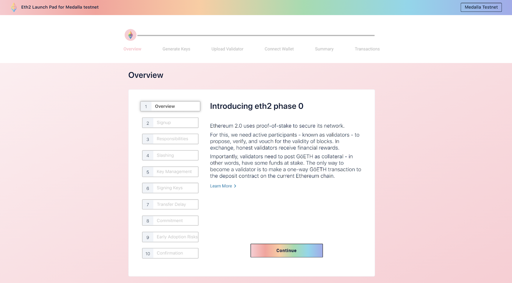
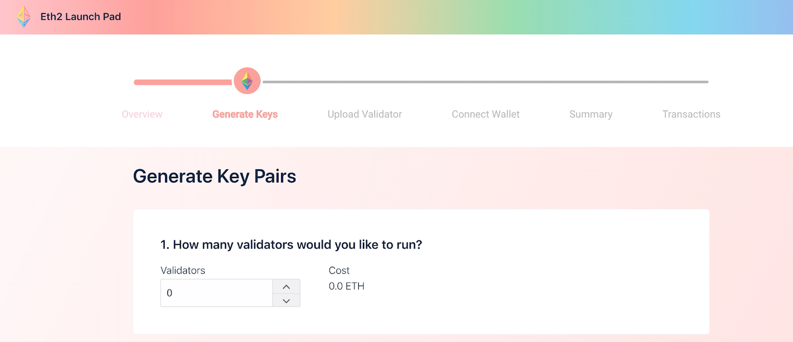
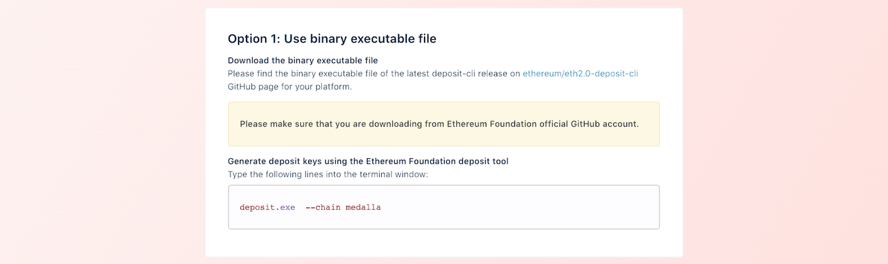
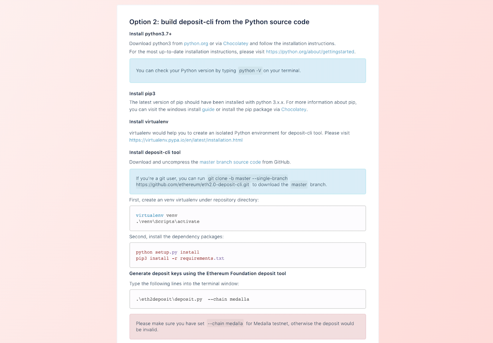
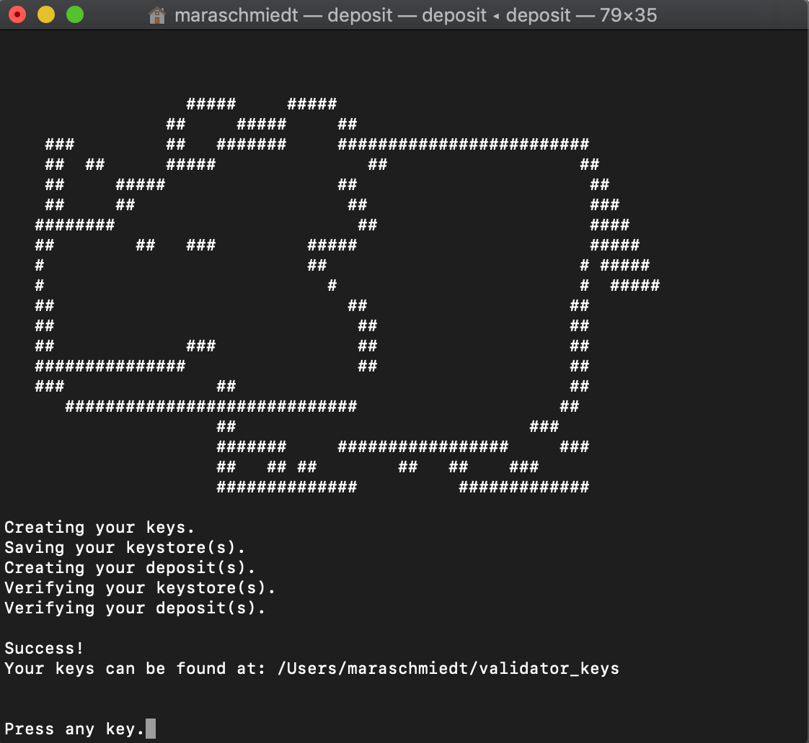
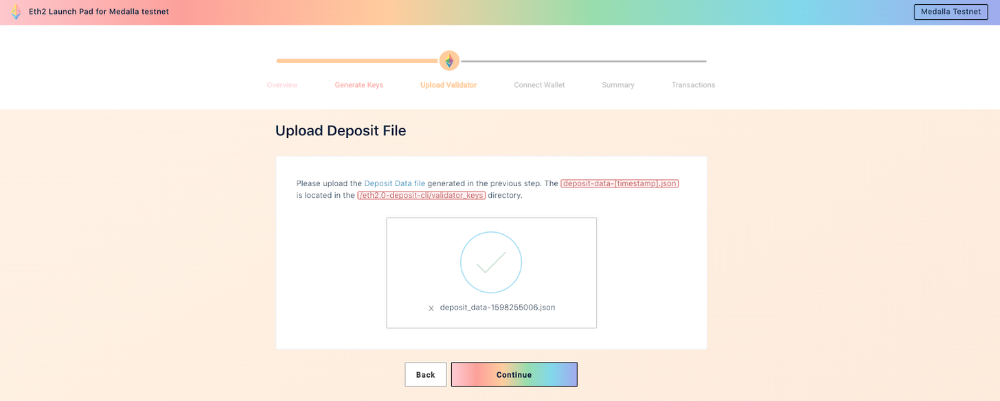
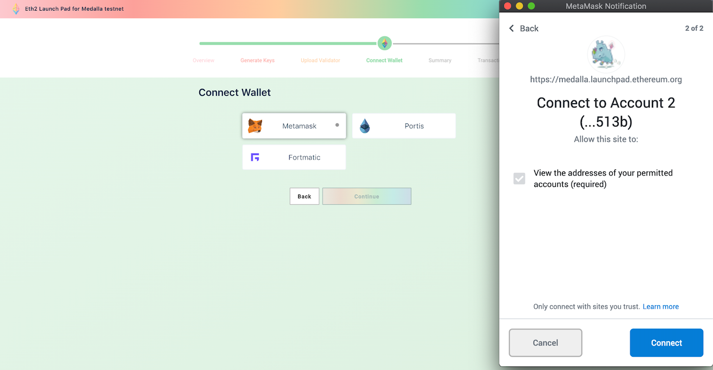
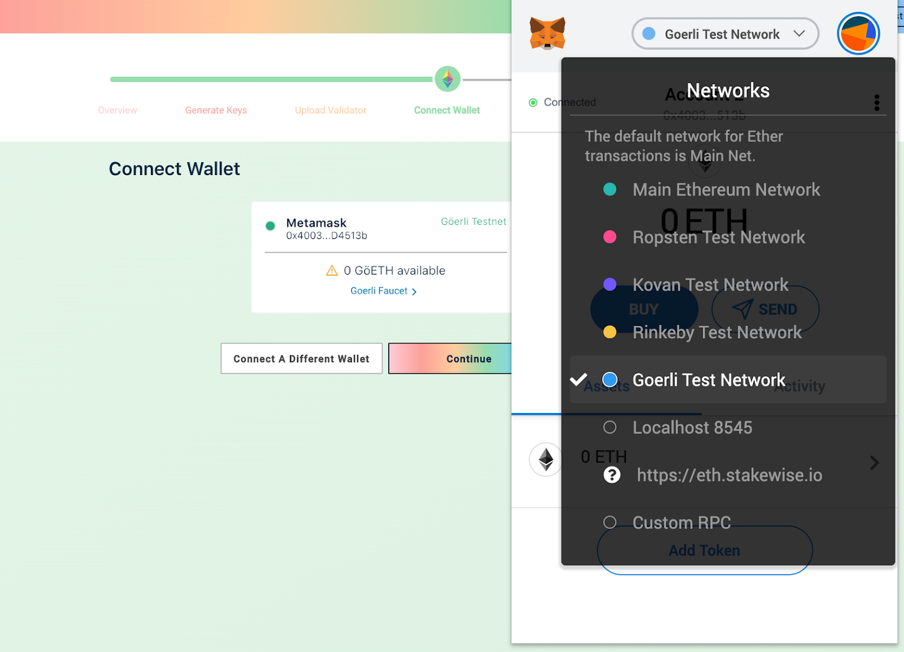
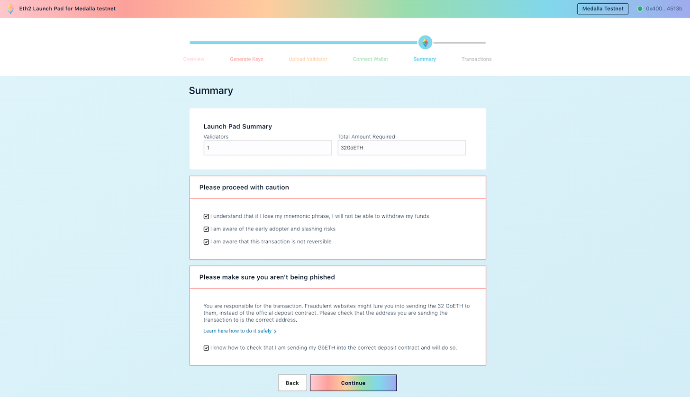

# 测试网质押教程

## Pyrmont 测试网质押教程

###  [Ubuntu/Lighthouse](https://someresat.medium.com/guide-to-staking-on-ethereum-2-0-ubuntu-pyrmont-lighthouse-a634d3b87393?sk=459494148fdab0b03c675ea0864d7486) 

###  [Ubuntu/Nimbus](https://someresat.medium.com/guide-to-staking-on-ethereum-2-0-ubuntu-pyrmont-nimbus-e6592c110843?sk=c0ef6aefdf68305739832a569ed0a454)

###  [Ubuntu/Prysm](https://someresat.medium.com/guide-to-staking-on-ethereum-2-0-ubuntu-pyrmont-prysm-a10b5129c7e3?sk=bf99be4e432410badda3d2844f3d95d3)

###  [Ubuntu/Teku](https://someresat.medium.com/guide-to-staking-on-ethereum-2-0-testnet-ubuntu-pyrmont-teku-3da74372910?sk=835747c0fab93ccf85b4866ffae74b25)

## Medalla 测试网质押教程

### **硬件要求** 

基于Eth2的去中心化设计目标，验证者预计能够使用多种不同的基础设施设置 \(本地或云端等\)。

参与测试网不仅能够实战演练，还能给自己充裕的时间来选择哪种设备和方式最为适宜，拥有最可靠的性能。而目前这也是我们唯一能做的事。

以下是一些硬件配置、资源链接以及有参考意义的教程。

#### ➤ **推荐配置**

操作系统：64位Linux、Mac OS X、Windows

处理器：Intel Core i7-4770或AMD FX-8310 \(及以上\)

内存：8GB RAM

容量：100GB可用空间SSD

网络：宽带网络 \(10 Mbps\)

电源：不间断电源 \(UPS\)

**Digital Ocean \(满足条件的云服务商\)**

[标准Droplet](https://www.digitalocean.com/pricing/)

内存：8GB RAM

容量：160GB可用空间SSD

运行时间：99.99%

可用性：8个数据中心

费用：0.060美元/小时；40美元/月

**符合条件的硬件设备：**

[ZOTAC ZBOX CI662 Nano Silent Passive-Cooled Mini PC 10th Gen Intel Core i7](https://www.amazon.com/ZOTAC-Passive-Cooled-Quad-core-Barebones-ZBOX-CI662NANO-U/dp/B08CVW7ZTC/ref=sr_1_14?crid=3H3C58N0E4ADZ&dchild=1&keywords=mini+pc+barebones+i7&qid=1598263033&sprefix=mini+PC+barebones+%2Caps%2C767&sr=8-14)

[SanDisk Ultra 3D NAND 2TB Internal SSD](https://www.amazon.com/SanDisk-Ultra-NAND-Internal-SDSSDH3-2T00-G25/dp/B071KGS72Q/ref=sr_1_2?crid=1KNWA41H1VO9Q&dchild=1&keywords=sandisk+ssd+plus+2tb+internal+ssd+-+sata+iii+6&qid=1598262732&sprefix=sandisk+SSD+plus+2TB%2Caps%2C790&sr=8-2)

[Corsair Vengeance Performance SODIMM Memory 16GB \(2x8GB\)](https://www.amazon.com/Corsair-Vengeance-Performance-Unbuffered-Generation/dp/B08BLVHWXD/ref=sr_1_2?dchild=1&keywords=CORSAIR+VENGEANCE+SODIMM+16GB+%282x8GB%29&qid=1598262850&sr=8-2)

➤ **最低要求配置**

操作系统：64位Linux、Mac OS X、Windows

处理器：Intel Core i5-760或AMD FX-8110 \(及以上\)

内存：4GB RAM

容量：20GB可用空间SSD

网络：宽带网络 \(10Mbps\)

电源：不间断电源 \(UPS\)

**Digital Ocean \(满足条件的云服务商\)**

[标准Droplet](https://www.digitalocean.com/pricing/)

内存：4GB RAM

容量：80GB可用空间SSD

运行时间：99.99%

可用性：8个数据中心

费用：0.030美元/小时；20美元/月

**符合条件的硬件设备:**

[ZOTAC ZBOX CI642 Nano Silent Passive-Cooled Mini PC 10th Gen Intel Core i5](https://www.amazon.com/ZOTAC-Passive-Cooled-Quad-core-Barebones-ZBOX-CI642NANO-U/dp/B08BBN3LS5/ref=sr_1_41?dchild=1&keywords=mini+pc+barebones+i5&qid=1598263166&sr=8-41)

[SanDisk Ultra 3D NAND 2TB Internal SSD](https://www.amazon.com/SanDisk-Ultra-NAND-Internal-SDSSDH3-2T00-G25/dp/B071KGS72Q/ref=sr_1_2?crid=1KNWA41H1VO9Q&dchild=1&keywords=sandisk+ssd+plus+2tb+internal+ssd+-+sata+iii+6&qid=1598262732&sprefix=sandisk+SSD+plus+2TB%2Caps%2C790&sr=8-2)

[Corsair Vengeance Performance SODIMM Memory 8GB](https://www.amazon.com/Corsair-Vengeance-Performance-CMSX8GX4M1A2400C16-2400MHz/dp/B077SB72QN/ref=sr_1_1?dchild=1&keywords=CORSAIR+VENGEANCE+SODIMM+8GB&qid=1598263273&sr=8-1)

### **设置一个Eth1节点**

验证者在Eth2上运行节点，需要先运行Eth1节点，以便监视32个ETH的验证者存款。在运行Eth1节点时，用户有多种选择，以下是一些最常用的工具。

**自托管：**

[OpenEthereum](https://www.parity.io/ethereum/)**、**[Geth](https://geth.ethereum.org/)、[Besu](https://besu.hyperledger.org/en/stable/)、[Nethermind](https://www.nethermind.io/)

**第三方托管：**[Infura](https://infura.io/)

### **在Medalla上运行Eth2验证者节点**

#### **第一步: 在Goerli测试网上质押ETH**

如果读者刚接触以太坊，那么加入网络的主要方式就是参与质押。Eth2的Medalla测试网需要每位验证者质押32个GöETH \(除了使用Goerli测试币，其他步骤与真正的Eth2没什么不一样！\)

如果用户想要参与测试网，以下是一些十分有用的工具以简化参与流程。

➤ Prysmatic的 [Discord](https://discord.gg/KSA7rPr) \(获得goerli测试币的通道\)

* Prysmatic团队已经自动化该过程
* 只需在discord里留言“!send \(你的以太坊地址\)”即可

➤ EthStaker的 [Discord](https://discord.gg/) \(获得goerli测试币的通道\)

* 该自动程序由Beaconcha.in运行和维护
* 只需留言“!goerliEth \(你的以太坊地址\)”即可

➤ [Goerli认证水龙头](https://faucet.goerli.mudit.blog/) \(Goerli Authenticated Faucet\)

* 只需复制粘贴你的ETH地址，然后选择‘请求’即可

#### **第二步: 前往**[**Eth2 Launchpad**](https://medalla.launchpad.ethereum.org/)\*\*\*\*

过去几个月以来，以太坊基金会、Codefi Activate以及Deep Work Studio都在研究开发一个界面，使得用户更简单地参与质押并且成为Eth2.0的验证者。

研究结果就是Eth2 Launch Pad，该应用可以让用户安全地完成以下步骤：生成Eth2密钥对，在Eth2测试网和主网上的正式存款合约里质押32个ETH。

Launch Pad专门为在家中运行节点的验证者设计。这些以太坊爱好者想要运行自己的节点，并且在自己的电脑终端屏幕上轻松地运行指令。

#### **第二步\(a\): 尽职调查 \(概述部分\)**

在参与质押之前，应该花点时间来读读这些内容。“概述部分”提供了一些教育信息，关于质押ETH所面临的一些风险。

#### **第三步: 生成密钥对以及助记词**

每一个验证者节点，都要生成自己的验证者密钥对和助记词，以便之后生成提款密钥。

第一步，用户需要选择想要运行的验证者节点数量，以及在哪个操作系统运行。

Launchpad会给提供两种选择来生成用户自己的存款密钥。点进此链接，获取用户操作系统的更多说明细节：https://github.com/ethereum/eth2.0-deposit-cli/blob/master/README.md

第一种选择是使用[从ethereum/eth2.0-deposit-cli页面下载的二进制可执行文件，在自己的终端运行./deposit指令。](https://github.com/ethereum/eth2.0-deposit-cli/releases/)

第二种选择是从Python源代码中构建deposit-CLI工具。参与者需要按照以下说明操作，以确保安装了所有必需的开发库和deposit-CLI工具。

完成之后，在自己的终端运行.\eth2deposit\deposit.py指令。

当用户安装了deposit-CLI工具并在终端窗口中运行它后，将收到以下提示:

1. 确定要运行的验证者节点数量

2.确定使用哪个语言来生成助记词

3.确定在哪个测试网来运行验证者节点

**请选择Medalla测试网，作为本次教程。**

现在用户将被要求设置密码，一旦密码确认，用户的助记词将生成。**确保把它记在一个安全的地方，并离线存储。**

如果用户顺利完成这一步了，将会看到下图所示的屏幕：

如果大家对deposit-cli有任何问题，请访问下面的**GitHub库：**

https://github.com/ethereum/eth2.0-deposit-cli

#### \*\*\*\*

#### **第四步: 上传你的存款文件**

就快成功啦！下一步就是上传你在前一个步骤中生成的存款json文件。

该文件位于/eth2.0-deposit-cli/validator\_keys目录中，标题为deposit-data-\[timestamp\].json。

\*\*\*\*

**第五步: 连接自己的钱包**

下一步是连接你的Web3钱包并点击继续。确保在钱包设置中选择了Goerli测试网。

不要发送真的ETH到Medalla测试网的存款合约上。

\*\*\*\*

**第六步: 确认交易&启动存款**

连接并确认了你的钱包地址之后，接下来会去到一个总结页面，该页面显示了需要发送到存款合约的GoETH总额，这个总额基于用户运行的验证者的数量。

“同意”警告选项，单击确认导航到最后一步——实际存款。

点击“启动交易”将你的GoETH存入Medalla测试网合约中。

接下来需要通过钱包确认自己的GoETH存款，每个验证者节点需确认32个GoETH。交易一旦被确认，就代表你质押成功了！可以在最具有纪念意义的Web3测试网上称自己为正式的质押者了!

### 参考资源

[Bankless](https://bankless.substack.com/p/guide-becoming-a-validator-on-the): Guide: Becoming a Validator on the Eth2 Testnet

EthFans: [使用 Ubuntu 和 Prysm 参与 Medalla 测试网](https://ethfans.org/posts/guide-to-staking-on-ethereum-2-0-ubuntu-medalla-prysm)

EthFans: [使用 Nethermind 和 Lighthouse 运行以太坊 2.0 测试网的验证者](https://ethfans.org/posts/using-nethermind-to-run-a-validator-in-eth2)

## Spadina 测试网质押教程（视频）

### 时间线

* 1:14 - 3:18安装command line tools 
* 3:21 - 4:01安装homebrew 
* 4:02 - 4:37安装python3 
* 4:38 - 4:50安装virtualenv 
* 4:51 - 5:07安装git 
* 5:08 - 8:50验证者密钥生成器下载和安装 
* 8:55 - 10:30官网metamask质押操作 
* 10:39 - 16:00安装lighthouse客户端,启动

### 视频

[手把手视频教程教你如何运行以太坊验证者客户端 \(Spadina测试网\)](https://www.bilibili.com/video/BV1d5411L7k9/)

