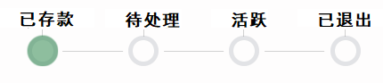
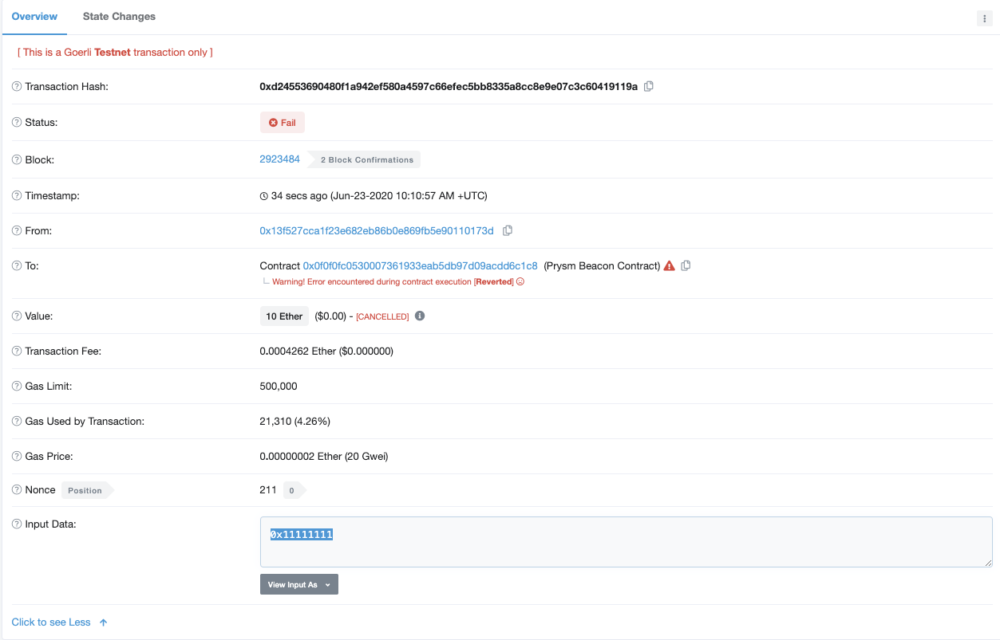
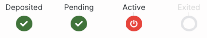
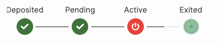
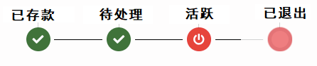
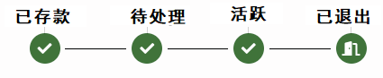

# 存款过程

## 存款合约

接下来我们分别看看上图的每个状态，并说明如何大致地确定每个状态的持续时间。

## Mempool-状态：未知

每一笔已签名的交易都得先访问**Mempool**，这可以称为交易的等候室。在此期间，交易状态为[pending \(待处理\)](https://etherscan.io/txsPending)。矿工会根据交易提供的gas费，选择优先处理让他们获益最大的交易。如果网络高度拥挤 \(即许多交易待处理\)，则新交易提交的**gas费**很有可能超过旧交易，从而导致旧交易的等待时间为**未知**。

## 存款合约-状态：已存款

一旦交易到达存款合约，**存款合约**就会检查交易的输入数据和价值。如果**交易额**低于1 ETH的**最低限制**，或者交易输入数据**不存在/无效**，交易将**被拒绝**并退回给发送方。

如下图所示，用户端创建的输入数据正体现了Eth2.0即将上线的验证者密钥和提款密钥。点击此处阅读《Eth2.0密钥》一文。

**为什么要花7.5个小时呢？**

为了确保交易不会因区块重组而作废 \(开发者以代码呈现ETH1\_FOLLOW\_DISTANCE\)，Eth2.0会将进入存款合约之后1024个Eth1.0区块的交易纳入考虑。处理完1024个Eth1.0区块后，还必须等待32个Eth2.0 Epochs \(时段\)，信标链才能识别该存款。在这32 Epochs过程中，验证者对新存款进行投票。然而，如果出现区块提议失败或者Eth1.0恶意节点 \(负责将存款记录提供给Eth2.0网络\)，就会导致更长的等待时间。既然如此，不如尝试自己运行节点吧！

计算方式：1024个区块= 1024 x〜13秒= 13,312秒=〜4小时，32 Epochs= 32 x 6.4分钟= 204.8分钟=〜3.5小时。

同样，Eth2.0链识别出存款之后（7.5小时后），通过beaconcha.in浏览器可查看，验证者状态将更新为已存款。

## 验证者队列-状态：待处理

到了这步，信标链可以访问存款了。根据总共的存款数量，会产生一条验证者队伍。 每个Epoch仅激活四个验证者 \(每天激活900个验证者\)。

注意：前16,384个验证者 \(即创世验证者\) 不需要排队，而是直接从Slot 0开始质押。

## 质押-状态：活跃

验证者现在质押状态已被激活，可以提议区块并对证明进行签名——他们即将获得奖励！

## 其他验证者状态

* 存款无效 \(Deposit Invalid\)

        交易的[BLS](https://kb.beaconcha.in/ethereum-2-keys)签名无效。

* 验证者离线 \(Active Offline\)

        即活跃验证者在2个epochs中未进行证明工作。

* 在线验证者退出

       由于验证者余额低于16ETH或验证者请求退出，处于在线状态的验证者当前正在退出网络。

* 离线验证者退出 \(Exiting Offline\)

        由于验证者余额低于16ETH或验证者请求退出，处于离线状态的验证者当前正在退出网络。

* 在线验证者罚没 \(Slashing Online\)

        在线验证者作恶，被驱逐出网络。

* 离线验证者罚没 \(Slashing Offline\)

        验证者处于离线状态，但实施过恶意行径被驱除出网络。验证者正排队退出网络，需要等候至少25分钟。

* 被罚没\(Slashed\)

        验证者已被驱逐出网络，资金可在36天后提取。

* 已退出 \(Exited\)

        验证者已退出网络，资金可在一天后提取。

