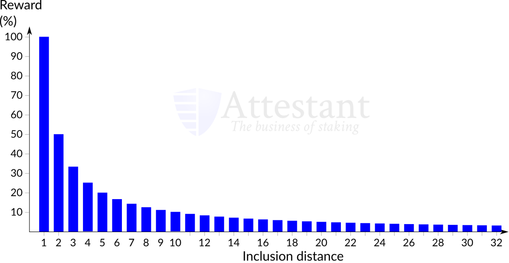

# 证明

## 何为证明

证明指的是由验证者就Eth2.0区块链当前状态所发起的投票。每位活跃验证者每epoch（约6.5分钟）发起一次证明，由以下元素组成：

其中一个有趣的过程是链头投票，指的是验证者投票证明出最新的有效区块，即链头。链头投票的组成见下图：

在这里，slot指的是验证者投票证明当前链头所在的位置，哈希值则标识了验证者所在的位置。而这两者组合起来，独特地标识出区块链上的某一点，并且获得足够的票数之后，网络就链的状态达成了共识。

尽管每个证明中的数据都相对较小，但随着成千上万的验证者参与，该数据会迅速庞大起来。由于此数据将永远存储在链上，因此减少储存数据的大小很重要，可以通过聚合（aggregation）过程来实现。

聚合由多个证明组成，并且所有证明都由同一委员会投票，包括链头投票和最终确定性投票，然后将其合并成为一个聚合证明：

聚合证明与简单证明在两个方面有所不同。首先，聚合证明中有多个验证者。其次，他的签名是聚合签名，由匹配的简单证明的签名构成的。聚合证明非常有利于存储，但是会带来额外的通信和计算负担（更多信息请参见下文）。

如果要求每个验证者聚合所有证明，这意味着每一个证明的信息都需传递给每位验证者，其中的通信总量会迅速使网络超载。同样的，如果聚合是可选可不选的，那么验证者不会情愿浪费自己的资源。然而如果我们换一种方式，由网络来选择验证者子集执行聚合任务。那么他们会更乐意做好自己工作，因为聚集证明所包含的验证者数量更多，更有可能被打包进链，意味着验证者将更有可能获得奖励。

执行此聚合过程的验证者被称为聚合者（affregators）。  

## 提高证明奖励

Eth2.0使用打包距离度量（metric inclusion distance）来计算验证者证明所获得的奖励。一个slot的打包距离指的是进行证明的slot与最先打包证明进区块的slot之间的差。例如，在slot ss中进行证明，而在slot s+1s+1中被打包进区块，那么打包距离为11。如果是在s + 5s + 5处被打包进区块，则打包距离为55。

**在Eth2.0中，证明的价值取决于其打包距离，打包距离越短越好。这是因为信息越早呈现在网络上，它就越有用。**

为了体现证明的相对价值，根据打包距离的大小，对负责证明的验证者给予不同的奖励。具体来说，奖励乘以1/d，其中d是打包距离。

如果网络运行良好，所有证明的打包距离将会是1。这意味着证明实现最大的有效性，并且相应地获得最大的奖励。如果证明产生延迟，那么验证者获得的奖励将相应地减少。  

## 打包证明过程

那么证明是如何打包进Eth2.0区块链的呢？过程如下：

1.每个证明验证者都会根据链状态相关的数据生成证明；

2.证明广播到Eth2.0网络中相应的聚合者中；

3.而收到证明的聚合者将其与其他由同一个委员会投票的证明合并起来；

4.聚合证明被广播至0网络的所有节点中；以及

5.如果聚合证明还没有被添加到链上，任意一个提议区块的验证者能够将其打包进区块。

当证明的打包距离超过1时，我们就有必要搞清楚其中原因，有以下几种影响因素：

### 证明生成延迟（Attestation Generation Delay）

验证者可能会出现“证明产生延迟”的问题。比如，关于链状态的信息可能会出现过时的状况，或者验证者能力不足，需要花很多时间来生成证明以及对证明进行签名。无论出于何种原因，延迟的证明对于该过程的其余步骤都有间接影响。

### 证明广播延迟（Attestation Propagation Delay）

一旦有验证者生成证明，需要将其广播至网络的聚合者中。该过程旨在让聚合者及时接收到最早的证明信息，从而在证明信息广播至整个网络之前便将证明聚合起来。验证者应尝试和尽可能多的其他验证者连接，以确保快速广播证明至聚合者中。

### 聚合产生延迟（Aggregate Generation Delay）

证明聚合过程可能会出现延迟的状况。其中最常见的原因是，产生的证明使得节点超载。然而，当有大量的验证者需要聚合证明时，聚合算法的速度也会造成聚合产生的明显延迟。

### 聚合广播延迟（Aggregate Propagation Delay）

类似于证明广播延迟，聚合证明也需要广播至网络，并且可能遭受相同的延迟。

### 区块产生失败（Block Production Failure）

证明要想要成为链上数据的一部分，必须得打包进区块。然而，区块产生有可能会失败。当验证者离线，或者没有成功同步网络其余验证者的数据时，生成的失效数据将被链否决。

区块产生失败会造成另一个影响，由于之前的有效证明没有打包进区块，下一个产生的区块需要接收更多的证明数据。如果可打包进下一个区块的证明超过了其所能容纳的范围，那么验证者将很有可能会选择那些有着最短的打包距离的证明，因为可以获得更多的奖励。这使得剩余的证明的打包奖励越来越少，导致证明错过最佳块以及随后的区块。

由于区块产生会受到验证者状态的影响，我们界定了最早打包slot，该slot是有效区块产生且进行证明的slot之后的第一个slot。这样的界定考虑到证明不能打包进不存在的块中，并且避免受到验证者有效性的影响。

### 作恶行为

尽管如此，恶意验证者还是有可能拒绝将任何给定的证明聚合起来，或者拒绝将证明打包进其区块里。前者的解决方法是为每个证明组分配多个聚合者，而后者的解决方法是对拒绝打包聚合证明进区块的行为进行惩罚。然而，拒绝打包进块的惩罚如果受到经济补偿，或者该行为在政治上更有价值，那么负责证明的验证者无法采取任何措施来强制负责产生区块的验证者打包证明进块。

## 计算证明的有效性

考虑到区块生产和打包距离，证明的有效性指的是一个证明对网络的有用性。其计算方式为：

并以百分比值表示。以下是一些有效性计算的例子：

| Attestation slot | Earliest inclusion slot | Actual inclusion slot | Calculation | Effectiveness |
| :--- | :--- | :--- | :--- | :--- |
| 5 | 6 | 6 | 6−56−56−56−5 | 100% |
| 5 | 6 | 7 | 6−57−56−57−5 | 50% |
| 5 | 6 | 8 | 6−58−56−58−5 | 33.3% |
| 5 | 7 | 7 | 7−57−57−57−5 | 100% |
| 5 | 7 | 8 | 7−58−57−58−5 | 66.7% |
| 5 | 7 | 9 | 7−59−57−59−5 | 50% |

如果一个证明因为其打包距离为最大值32而打包失败，那么该证明的有效性为0。  

## 聚合证明的有效性

对于单个证明来说，计算证明有效性或许有那么点意思，但就这个值本身来说没有多大的意义。而聚合证明的有效性（包含的时间更久以及更多的验证者），可以让我们更好地了解一组验证者的整体有效性。聚合证明的有效性是单个证明有效性的平均值。例如，对给定组中所有验证者的有效性进行7天的记录，取其平均值。  

## 总结

Eth2.0启动之后，成千上万个节点将彼此定位并开始提议区块以及对区块进行证明。与所有不成熟的网络一样，想要节点尽可能的有效还有很多问题要解决。如本文所述，用于记录节点效率的明确指标便是证明有效性。验证者如果想要最大程度地提高奖励，可以通过证明有效性来评判其自身整体表现。

## 参考来源

[Defining attestation effectiveness](https://www.attestant.io/posts/defining-attestation-effectiveness/#fnref2) by Jim McDonald

