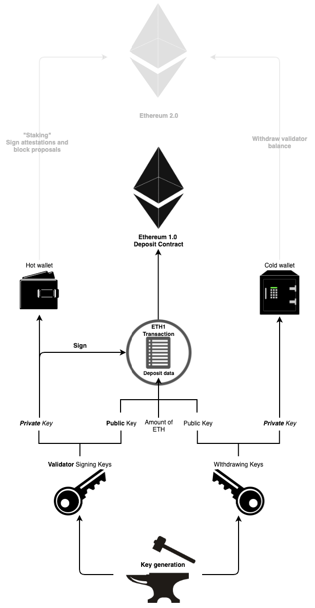
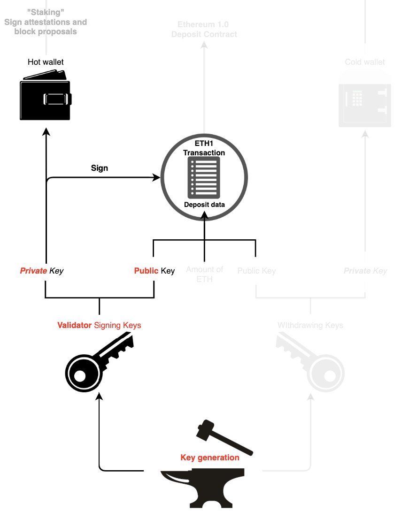
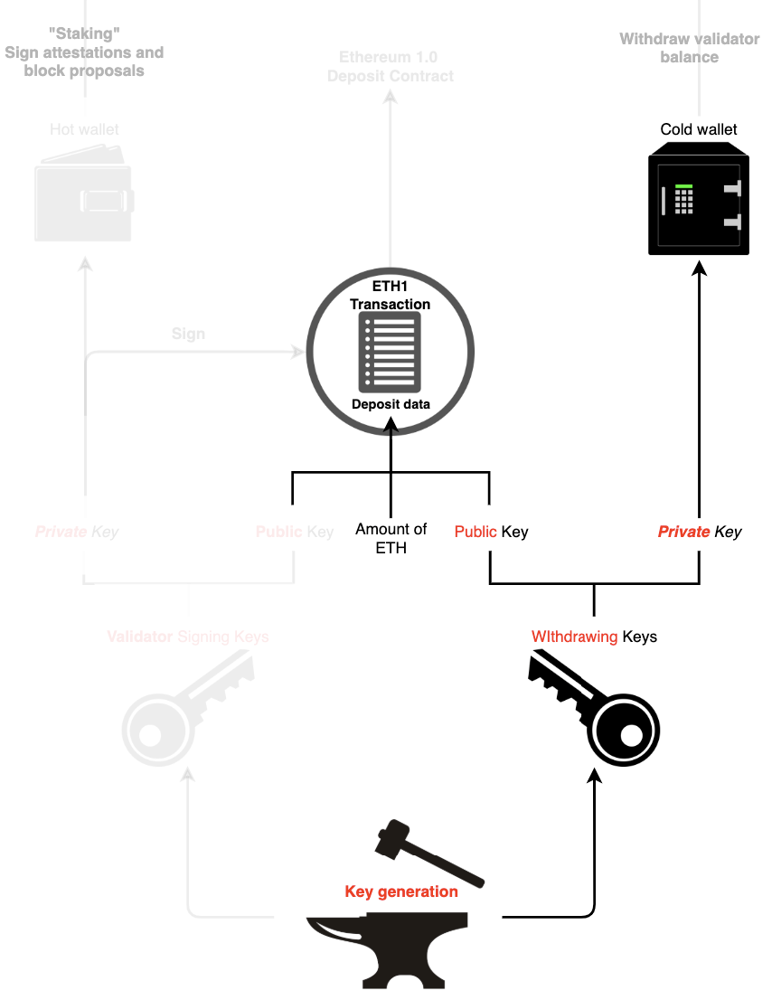
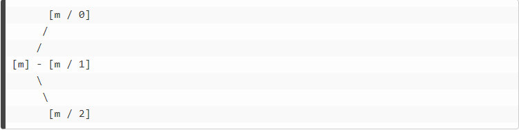
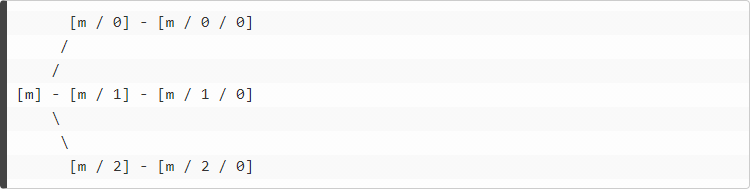

# 密钥篇

## Eth2.0 密钥概览

在以太坊1.0，用户访问他们的资金只需要**一个密钥**，而在以太坊2.0中则需要两个不同的密钥——**验证者签名密钥和提款密钥**。

## 验证者密钥

如下图所示，验证者密钥由两个元素组成：

* 验证者**签名密钥**
* 验证者**公钥**

➤ **签名密钥是验证者需要用于签名证明 \(attestation\) 和提议区块的密钥。**由于一个验证者在每个epoch内至少需要对一条消息进行签名，客户端软件必须对签名密钥进行托管。

这种灵活性使得验证者签名密钥可以快速地在设备间进行迁移。但是，如果密钥丢失了或被盗了，盗窃者可以**通过以下两种方式作恶**：

* 通过以下的做法使验证者被[罚没](https://kb.beaconcha.in/glossary#validator-lifecycle)：
  * 作为[区块提议者](https://news.ethereum.cn/ethereum-2-keys/#block-proposer)时，对同一个时隙\(slot\) 的两个不同信标区块进行签名投票
  * 作为[区块证明人](https://news.ethereum.cn/ethereum-2-keys/#attestations)时，对另外一个区块进行环绕证明投票
  * 作为[区块证明人](https://news.ethereum.cn/ethereum-2-keys/#attestations)时，对同一个目标检查点进行两次不同的证明投票
* 强行[主动退出](https://news.ethereum.cn/ethereum-2-keys/#validator-lifecycle)，阻止验证者质押，并给提款密钥所有者提供ETH余额的访问权限。

➤ **验证者公钥**包含在**存款数据**里，作用是使得ETH2能够识别验证者身份。

## 提款密钥

客户端软件始终保持互联网连接，因此验证者的签名密钥是完全有可能受到威胁的。为了减轻相应影响，验证者的操作需要通过两种密钥来实现。

如上所述，**验证者通过签名密钥履行其职责**。**而提款密钥可以控制验证者的资金 \(转移和提取ETH\)。**

**提款密钥也由两部分组成**：

* 提款密钥
* 提款公钥

丢失了这个密钥意味着无法访问验证者余额。但是，验证者仍然可以对证明投票和区块进行签名，因为这些操作只需要验证者签名密钥，只是如果密钥丢失了的话验证者这样做基本没法取得奖励。

要提款的话，验证者状态必须是[“已退出”](https://news.ethereum.cn/ethereum-2-keys/#validator-lifecycle)。

验证者在其整个生命周期内需要使用提款密钥的次数很少。也就是说，**可以将提款密钥可以使用冷存储方式，以极高的安全性进行存储 \(脱机\)。**

\*最早在阶段1才能进行转账和提款

## 太多密钥怎么办？

如果每质押32 ETH，质押者都需要保存并且使用两种不相关的密钥来进行存款，那么局面很快就会失控。

幸运的是，对此我们有一个解决方案：为密钥设置一个共用密钥，这样一来仅需存储一个密钥就可以访问多个密钥。

在eth2中，这个解决方案通过[EIP 2333](https://eips.ethereum.org/EIPS/eip-2333)和[2334](https://eips.ethereum.org/EIPS/eip-2334)实现：这组标准描述了提款密钥和签名密钥之间的关系，以及如何从单个助记词中导出它们。

### 助记词

助记词是对密钥进行编码的另一种方法，使得人们在存储和备份其私钥时更为简便。

举个例子，记录一组助记词`sausage solution loud isolate focus glide frame door clown million shuffle impulse` 比准确地记录一串密钥 `0x1e9f2afcc0737f4502e8d4238e4fe82d45077b2a549902b61d65367acecbccba`

### 通过助记词导出密钥

与钱包互动时，你可能会碰到格式为`m/44’/60’/0’/0/0`的“路径”。这些路径描述了密钥之间的关系。

根据[EIP 2333](https://eips.ethereum.org/EIPS/eip-2333)，其关系采用树结构的形式，其中密钥由熵源 \(树的seed\) 和树路径确定。

我们使用种子来计算树根，然后在基于树根层层构建。该密钥树完全根据其后分支之间的关系和树根来进行定义。

实际上，这使得我们可以从树的根部开始，并在每个分支上计算中间键，然后抵达相关叶子节点，从而在树中找到需要的任何键。

奇妙之处在于，我们可以从单个熵源 \(比如一个助记符\) 开始，然后基于此衍生出实际上无限数量的密钥。

此外，通过仅存储该助记符，你可以备份作为验证者所使用的每个密钥。

Eth2 就运用了这种理念，**允许通过单个助记符来生成验证者需要的任意数量的密钥**。举个例子，如果你想运行3个验证者节点，那么你可以借助单个助记符来生成位于`m/0`, `m/1`, `m/2` 的3个提款密钥。

每个分支都由 `/` 隔开，因此 `m/2` 表示从主密钥开始并跟随第2条分支。

在[EIP 2334](https://eips.ethereum.org/EIPS/eip-2334)中，验证者的签名密钥是提款密钥的第`0`个子分支。也就是说，在实际情况中，当你遵循这个标准时，如果知道了用于提款的私钥，那么你可以计算出相应的签名私钥。

继续上方的例子，我们可以在`m/0/0`, `m/1/0`, `m/2/0`找到相应的三个签名密钥。

为了阐明概念，上面的例子尽可能简化了，但实际上涉及的路径要长一些 \([EIP 2334](https://eips.ethereum.org/EIPS/eip-2334) 要求分别使用 `m/12381/3600/i/0` 和 `m/12381/3600/i/0/0` 的路径来获得提款密钥和签名密钥\)。但其中的逻辑和上面的例子相同。

总而言之，需要记住的要点就是：**如果你知道助记词，那你就可以计算出提款密钥，继而通过提款密钥得到你的签名密钥。**

## 存款密钥

验证者客户端使用keystore文件作为交换密钥的方式。

Keystore 是经由用户密码加密的包含私钥的文件。只要该密码不是存储在同一台计算机上，Keystore就可以在不同的计算机之间安全进行存储和传输。

当准备开始验证时，要向你的验证者客户端提供 Keystore和对其进行加密的密码，客户端需要这两条信息才能导入私钥。

## 成为验证者

要成为验证者，首先要生成适当的密钥。当你记下自己的助记符，密钥就能够生成。

**由于在阶段0期间无法提取或转移ETH，所以不需要通过Keystore来获取提款密钥，只需保证助记符以安全方式进行存储就够了。**

当验证者客户端需要用到签名密钥时，你的每个验证者节点都会收到一个存储相应密钥的Keystore文件。

生成密钥后，就是质押时刻了！每个验证者都需要质押32 ETH，以及质押数据，其中包含你所有的验证者公钥。

之后质押数据将会被记录在eth1的存款合约中。存款合约会由eth2节点进行监控，以便之后将质押数据复制到eth2中。一旦你的质押数据被成功转移到eth2上，那么你就正式成为了一名验证者！

## 参考来源

[Validated, staking on eth2: \#4 - Keys](https://blog.ethereum.org/2020/05/21/keys/) by Carl Beekhuizen

[Ethereum 2.0 Keys](https://kb.beaconcha.in/ethereum-2-keys) by beaconcha.in

