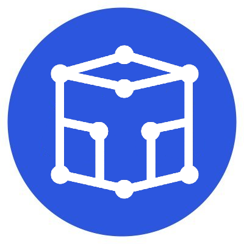

# Teku - ConsenSys

## 简介

Teku最先由ConsenSys的一支50人工程团队PegaSys研究开发，其后加入开源联盟Hyperledger，改名为Besu。“为公有链社区和领先企业打造以太坊技术”是这个团队的主要理念。除了支持以太坊公有链主网的建设外，他们还研究隐私性、可扩展性、提供许可等其他功能，使以太坊技术能够满足企业需求。

ConsenSys是一家市场领先的区块链技术公司，从开发者工具到企业解决方案，ConsenSys为更开放、高效和安全的经济系统搭建以太坊区块链基础设施和应用，他们的产品包括Infura、Quorum、Codefi、MetaMask等。

## Teku 

Teku是一个旨在满足机构需求和安全要求的开源以太坊2.0客户端。它使用Java语言编写，包含信标全节点实现，以及参与共识的验证者客户端。

特色：提供与企业级密钥储存兼容的外部密钥管理

            由领先的以太坊企业客户端Hyperledger Besu背后的团队搭建，等

### 支持系统

**Linux  Unix  macOS  Windows**

[官方教程](https://docs.teku.consensys.net/en/latest/)

| Teku | 规格 |
| :--- | :--- |
| 开发语言 | Java语言 |
| 是否支持docker | 支持 |
| 技术更新 | [Github](https://github.com/ConsenSys/teku) |
| 动态更新 | [推特](https://twitter.com/Teku_ConsenSys) |

## 团队成员

| 成员 | 简介 |  |  |
| :--- | :--- | :--- | :--- |
| Adrian Sutton | 团队成员，以太坊开发者 | [Github](https://github.com/ajsutton) | [推特](https://twitter.com/ajsutton) |
| Cem Ozer | 团队成员，以太坊开发者 | [Github](https://github.com/cemozerr) |  |
| Steven Schroeder | 团队成员，以太坊开发者、研究员 | [Github](https://github.com/schroedingerscode) | [推特](https://twitter.com/schroedingerdev) |
| Ben Edgington | 团队成员，以太坊开发者 | [Github](https://github.com/benjaminion) | [推特](https://twitter.com/benjaminion_xyz) |

## 资助情况

## 资源

* [Website  ](https://consensys.net/knowledge-base/ethereum-2/teku/) 
* [Gitter](https://gitter.im/PegaSysEng/artemis)

