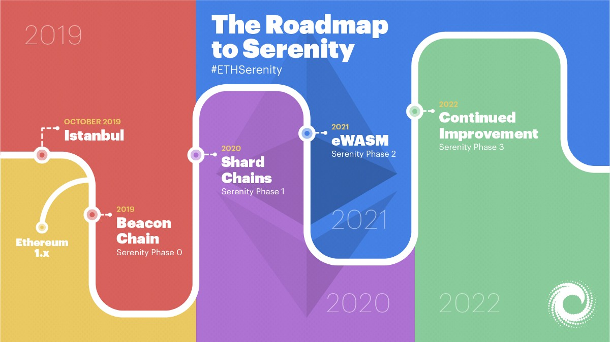

# 迈向宁静Serenity

## **来者可期：Serenity来临**

放眼未来，“宁静”\(Serenity\)是以太坊区块链的终极目的地，但在这之前还将经历伊斯坦布尔硬分叉和“以太坊1.x”阶段。伊斯坦布尔硬分叉将主要由围绕着ProgPoW \(Programmatic Proof-of-Work\)共识算法展开。“宁静”\(Serenity\)的主要内容包括从工作量证明\(PoW\)到权益证明\(PoS\)的完全转变，同时也将完成其他重要的升级：引入信标链\(beacon chain\)、分片\(sharding\)概念；以及用eWASM \(Ethereum-flavored Web Assembly\)替代以太坊虚拟机\(EVM\)。Serenity的所有升级都将分阶段实现，在此期间，以太坊1.x也将持续得到完善，以确保原始PoW链的延续。

以太坊的发展路线一直以来都持续针对核心协议进行更新升级。以太坊于今年二月完成了君士坦丁堡升级，不久后又将迎来伊斯坦布尔硬分叉。这意味以太坊社区距Serenity将更近一步。

Serenity作为以太坊升级的最后一次迭代，其重要性不言自明。2018年，Vitalik在Devcon上详细阐释了Serenity将分成多个阶段进行，并且每个阶段预计间隔一年。

以太坊2.0，也就是大家所熟知的Serenity阶段，秉承着五个设计原则：简洁性、强韧性、持久性、安全性、去中心化。之所以要采用循序渐进的方式实现Serenity，是为了实现以上所有原则，从而进一步将以太坊打造成区块链解决方案的市场领军者。

## **准备：伊斯坦布尔硬分叉**

在正式开启Serenity之前，以太坊需要执行伊斯坦布尔硬分叉，这是继今年2月君士坦丁堡升级后的最后一次计划内硬分叉。此次伊斯坦布尔硬分叉预期将于2019年10月进行，该分叉目前包含11个EIPs，其中之一就是EIP 1057 \[ProgPoW\]。

ProgPoW\(Programmatic Proof-of-Work\)的相关讨论已经在以太坊社区中持续了一段时间。此EIP建议将协议中的挖矿算法切换为ProgPoW，由于ASIC挖矿效率明显优于GPU，该算法旨在削弱ASIC的挖矿优势。

ASIC（专用集成电路）和GPU（图形处理器，即显卡）都是可用于加密货币挖矿的硬件设备。ASIC是高度专业化的硬件，使用ASIC通常可以更高效地进行挖矿作业，从而产生更可观的收益。然而，ASIC的专用性极高，这就意味着用来进行比特币挖矿的ASIC适用于比特币区块链，而进行以太币挖矿的ASIC仅适用于以太坊区块链。虽然效率较高，但ASIC的成本高昂且难以获取，如此一来就可能会导致中心化风险：矿池将被掌控在有能力获取ASIC的矿工手上（这也是长期争论不休的话题）。相比之下，GPU作为通用计算工具也可用于解决许多用例的复杂运算。较之ASIC，GPU可用来对任何加密货币进行挖矿，并且易于获得，使用广泛。然而，也因为GPU不具有类似ASIC的专用算力，其效率和收益远低于ASIC。

一旦EIP 1057被通过，使用抗ASIC的ProgPoW算法将使得ASIC和GPU在进行ETH挖矿时具有同等效率，从而确保了网络的去中心化（此说法仍然具有争议）。总的来看，以太坊的核心开发者似乎都是ProgPoW的拥趸，但他们在作出最终决策前已经启用了针对该算法的第三方审计措施。

## 阶段0：信标链 __2019

预计在2019年，Serenity第一阶段将推出信标链\(Beacon Chain\)。信标链是基于权益证明\(Proof of Stake\)的区块链，信标链的部署将标志工作量证明\(PoW\)到权益证明\(PoS\)共识机制的转变。为了确保链的连续性不被破坏，信标链确立之后将与原始的以太坊PoW链并行。信标链的最初形态囊括了三个主要职责：

* **管理权益证明\(PoS\)共识机制：**PoS是这样一种共识机制：通过网络质押ETH而非耗费精力挖矿来最终确认新区块的产生。
* **处理区块的交叉联结：**使得区块交叉联结是信标链能够确定和维护分片链状态的主要方式。分片链将于阶段1进行部署，所以此更新是在为阶段1做准备。
* **引导达成共识和最终确定性：**信标链通过PoS和Casper FFG共识机制达成最终确定性。PoS规定，2/3的验证者必须在下一个行将产生的区块中质押ETH，这意味着对于潜在的恶意用户来说，施行不正当行为需要承担的经济风险非常之高。

## **阶段1：分片 2020年**

分片链是以太坊网络未来可扩容性的核心特征。从整体概念来看，分片是指：将某数据库（去中心化数据库或其他类型数据库）中许多节点的数据处理职责分割开，允许同时进行交易、存储和信息处理。分片理念与目前的以太坊主链模式完全不同，后者则需要每个全节点对每一笔交易进行处理和验证。

Serenity阶段1将在分片链上处理最终确定性和共识。此阶段的分片链更倾向于“测试运行”，而不是可以立即解决扩容问题的方案。信标链将对分片链的执行情况进行监督。验证者质押32个ETH之后将被随机分配到特定的分片链上进行验证工作（此处的随机性可以确保验证者的分配路径是不可预测的，否则将面临人为操纵的风险）。根据以太坊2.0规范，信标链将支持1024个分片链，每条分片链上将有128个节点进行验证工作。

## **阶段2：eWASM 2020或2021年**

在阶段2中，以太坊2.0升级中的重要功能将被聚合起来。随着新虚拟机eWASM \(Ethereum-flavored Web Assembly\)的引入，分片链将从相当基本的数据标记形态演变为功能完整的交易链，从而担当起以太坊网络扩容的重任。

为了维护区块链生态系统的正常运行，节点必须在虚拟机中执行交易和智能合约。以太坊1.0的虚拟机被称为EVM \(以太坊虚拟机\)。切换到以太坊2.0和信标链后，以太坊网络的虚拟机将升级为eWASM，这是一个基于Web Assembly的虚拟机，由万维网联盟（W3C）定义为开源标准。由于WASM支持多种编码语言，eWASM使得由任何语言编写的智能合约都能在以太坊上运行，而现有的EVM只允许由Solidity语言编写的智能合约。

## “以太坊1.x”

我们需要注意的是，在上文提到的**Serenity阶段0-2中，原有的以太坊PoW链并不会消失。**它将继续得到维护并且与信标链并行，原始PoW链上的矿工仍然能通过传统的挖矿方式获得ETH奖励。随着生态系统逐渐转移到信标链，PoW链可能面临淘汰（有人提议永远保留PoW链），前提是“难度炸弹”机制使得PoW运算的难度系数几近于不可能。

在信标链测试和概念验证期间，原有的以太坊1.0链没有止步不前，而是不断进行完善。这一系列升级和硬分叉就被称作“以太坊1.x”，旨在使当前的以太坊主链持续迭代，以满足信标链部署期间生态系统的需求和应用。

以太坊1.x背后的团队仍处于路线图规划的早期阶段，但他们已经确立了以太坊1.x升级的三个总目标：

1. 通过提高tx / s吞吐量促进主网扩容（优化客户端将大大提高每个区块的gas上限）
2. 收取“状态费用”以限制磁盘空间使用量，从而可以持续运行全节点
3. 升级虚拟机以改善开发人员体验。虚拟机升级包括eWASM和交易模式的改变，新交易模式可以使整体交易费用更加稳定。
4. 开发最终确定性工具，利用信标链对以太坊x中的区块进行最终确定，从而连接以太坊1.0和2.0版本。

跟进以太坊1.x的升级更新及其团队动向可以前往：  
https://docs.ethhub.io/ethereum-roadmap/ethereum-1.x/  
https://en.ethereum.wiki/eth1

## 阶段3：后续升级 \| 2022

阶段2之后，以太坊的发展时间线就没那么明晰了。这也是情理之中的事，因为区块链技术的发展日新月异，开发人员需要继续致力于解决问题、改进协议才能满足不断增长的需求。仍处于讨论阶段的后续升级包括：轻客户端状态协议、主链安全性耦合以及超二次或指数性分片。若以太坊2.0进展顺利，以太坊也将顺势循次而进，届时“以太坊3.0”或将成为下一片新大陆。

\_\_

_原文链接：_[_https://media.consensys.net/the-roadmap-to-serenity-bc25d5807268_](https://media.consensys.net/the-roadmap-to-serenity-bc25d5807268)\_\_

